import Tabs from '@theme/Tabs';
import TabItem from '@theme/TabItem';

# Tutoriales

## 1. Todo sobre creación de cursos
_______________________________________________________________________________________
<Tabs>
  <TabItem value="creacion" label="Creación" default>
  Como crear un curso.
    1. Inicia sesion en la plataforma con tu cuenta de administrador.
    2. Da clic en el boton "+" que se encuentra en la parte inferior derecha.
    3. Rellena los campos que se relacionan a la descripción y contenido del curso.
    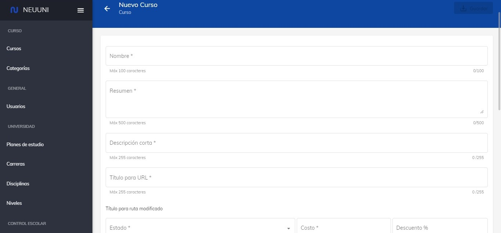
    4. Una vez hayas rellenado todos los campos;
     Da clic en el boton de guardar que aparece a la derecha hasta abajo al igual que encontraras el mismo boton arriba a la derecha.
  </TabItem>
  <TabItem value="intro" label="Introducción">
    Como editar la introducción de un curso.
    1. Seleccione el curso que deseé editar.
    2. De clic en el icono de editar dentro de la sección de introducción. 
    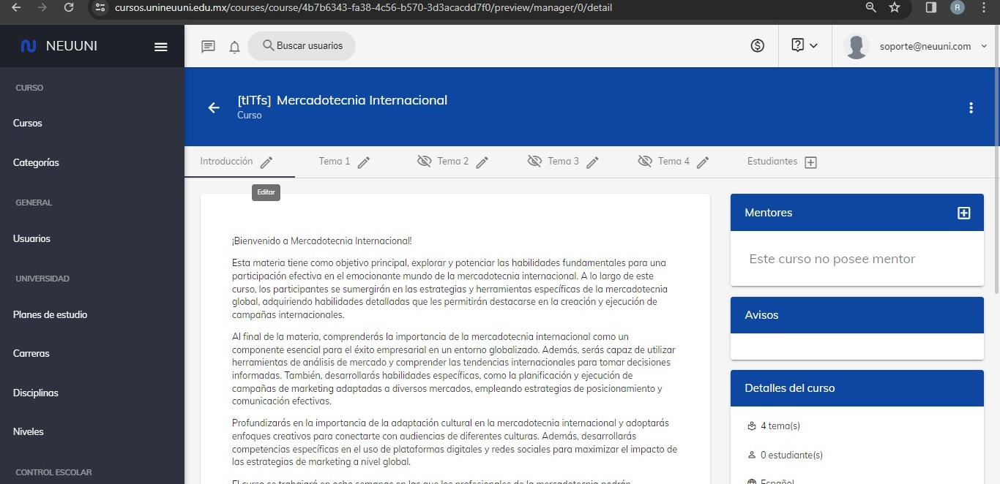
    3. Agrega el nuevo texto.
    4. Da clic en "Guardar cambios"
  </TabItem>
  <TabItem value="bloque" label="Título">
    Adicionar y eliminar bloque de texto título.
    1. Seleccione el curso que deseé editar.
    2. De clic en el icono de editar dentro de la sección de introducción.
    3. De clic en el boton "Adicionar bloque de texto" que se encuentra debajo.
    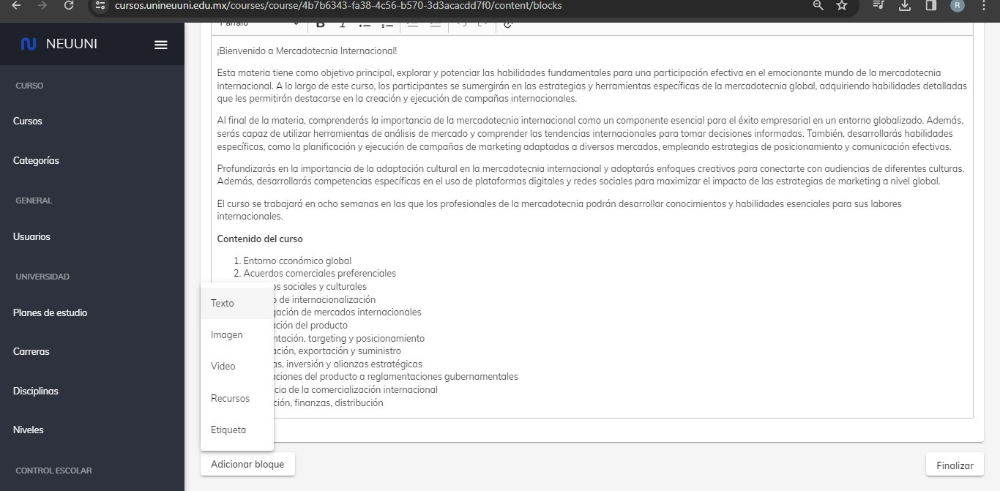
    4. Seleccione la opción de texto.
    5. Seleccione la opción de título.
      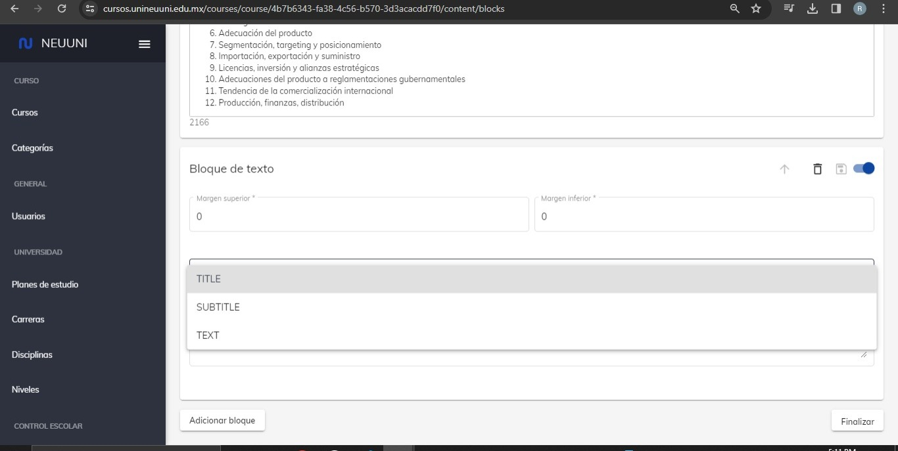
    6. Agrege el texto.
    7. De clic en guardar.
  </TabItem>
  <TabItem value="bloque2" label="Subtítulo">
    Adicionar y eliminar bloque de texto subtítulo
    1. Seleccione el curso que deseé editar.
    2. De clic en el icono de editar dentro de la sección de introducción.
    3. De clic en el boton "Adicionar bloque de texto" que se encuentra debajo.
    
    4. Seleccione la opción de texto.
    5. Seleccione la opción de subtítulo.
      
    6. Agrege el texto.
    7. De clic en guardar.
  </TabItem>
   <TabItem value="parrafo" label="Parrafo">
   Adicionar y eliminar bloque de parrafo.
   1. Seleccione el curso donde deseé introducir el parrafo.
   2. De clic en el icono de editar dentro de la sección de introducción.
   3. De clic en el boton "Adicionar bloque" que se encuentra debajo.
   4. Seleccione la opción de "texto".
   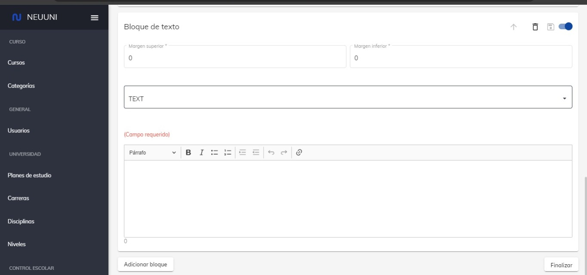
   5. Ingrese el contenido del parrafo.
   6. De clic en guardar.
  </TabItem>
   <TabItem value="Imagen" label="Imagen">
    Adicionar y eliminar bloque de imagen.
    1. Seleccione el curso que deseé editar.
    2. De clic en el icono de editar dentro de la sección de introducción.
    3. De clic en "Adicionar bloque".
    4. De clic en la opción de "Imagen".
    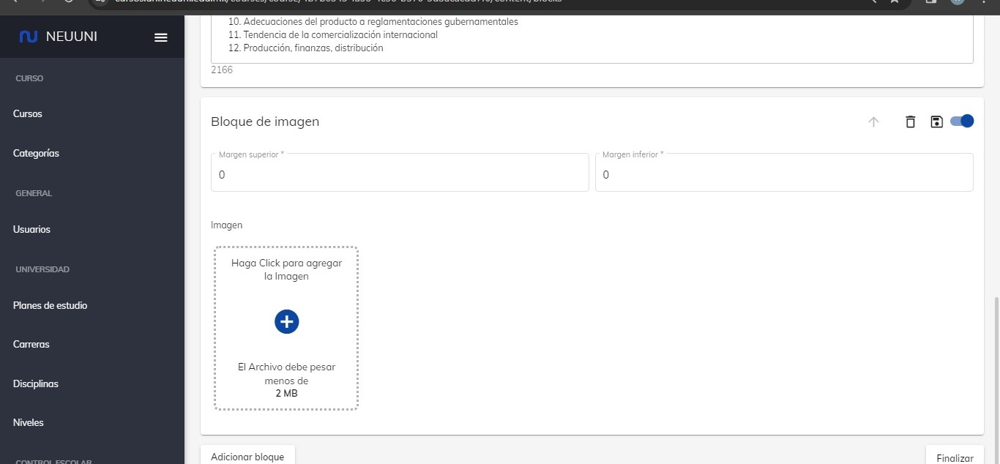
    5. Ingrese la imagen.
    6. De clic en guardar.
  </TabItem>
</Tabs>
_______________________________________________________________________________________

<Tabs>
  <TabItem value="recursos" label="Recursos" default>
    Adicionar y eliminar un bloque de recursos.

    1. Seleccione el curso que deseé editar.
    2. De cli en el icono de editar dentro de la seccion de introducción.
    3. Seleccione la opcion de "Adicionar bloque".
    4. De clic en la opción de "Recursos"
    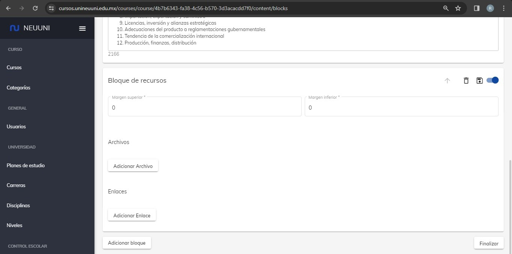
    5. Ingrese los recursos que deseé.
    6. De clic en guardar.
    
  </TabItem>
  <TabItem value="etiqueta" label="Etiquetas">
    Adicionar y eliminar etiquetas.
    1. Seleccione el curso que deseé editar
    2. De clic en el icono de editar dentro de la seccion de introducción.
    3. Seleccione la opción de "Adicionar bloque"
    4. De clic en la opción de "Etiquetas"
    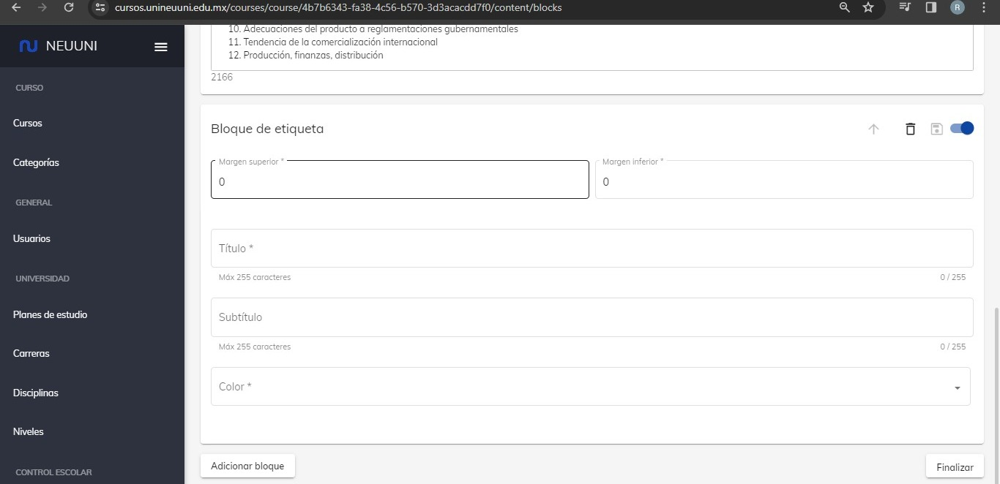
    5. Rellene los campos con la información relacionada a su etiqueta.
    6. De clic en guardar.
  </TabItem>
  <TabItem value="mentor" label="Mentor">
    Adicionar y eliminar Menntores de un curso.

    1. Seleccione el curso donde desee agrregar al mentor.
    2. De clic en el simbolo "+" que se encuentra en la parte derecha de la pantalla.

  Le aparecera una ventana.
  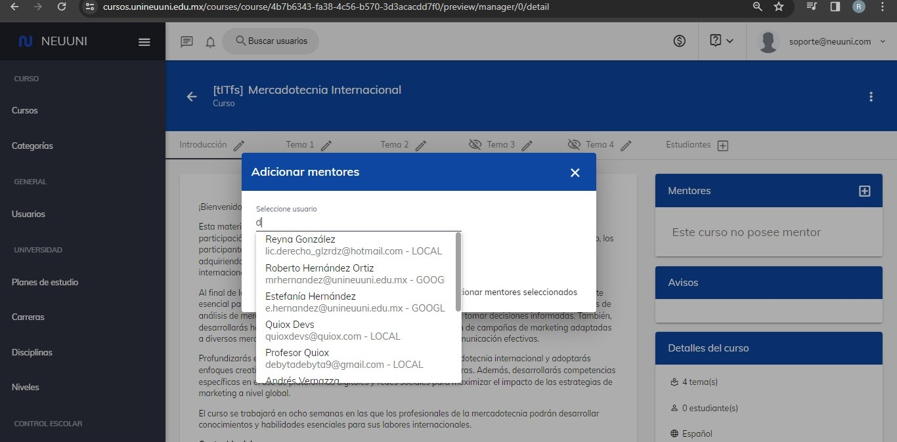
  3. Ingrese el nombre del mentor.
  4. De clic en guardar.
  </TabItem>
  <TabItem value="tema" label="Tema">
    Como adicionar un tema.
    1. Seleccione el curso donde deseé adicionar un nuevo tema.
    2. De clic en los 3 puntos ubicados en la parte superior de la derecha.
    3. Seleccione la opcion de "Adicionar tema".
    
    Le aparecera una ventana donde debera ingresar los datos relacionados con el tema.
    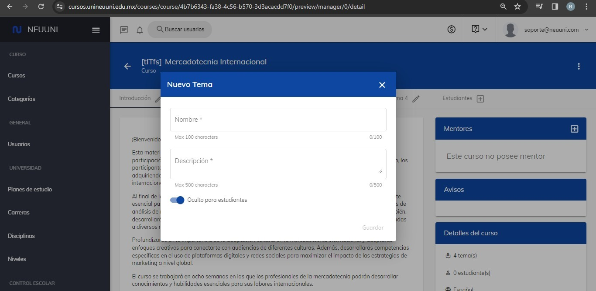
    4. Rellene los campos.
    5. De clic en guardar. 
  </TabItem>
   <TabItem value="Video" label="Video">
    Adicionar bloque de video.
    1. Seleccione el curso que deseé.
    2. De clic en clic en el icono de editar.
    3. Seleccione la opción de video.
     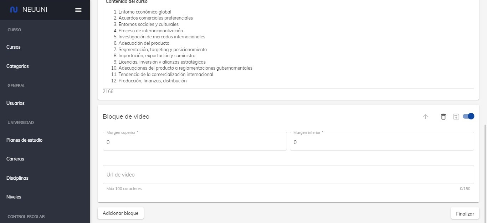
    4. Coloque la URL del video.
    5. De clic en guardar.
  </TabItem>
   <TabItem value="audio" label="Audio">
    Adicionar bloque de audio.
    1. Seleccione el curso que deseé.
    2. Seleccioneel tema.
    3. Seleccione la pestaña donde quiera agregar el audio.
    4. De clic en el icono de editar que se ecuentra en la parte superior de la derecha.
    5. De cli en en el boton "Adicionar bloque".
    6. Seleccione la opción de "App de audio".
    7. Ingrese la URL del audio y una imagen representativa.
     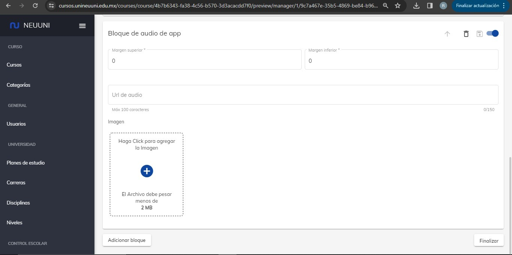
    8. De clic en guardar.
  </TabItem>
     <TabItem value="h5p" label="H5P">
    Adicionar bloque de audio.
    1. Seleccione el curso que deseé.
    2. Seleccioneel tema.
    3. Seleccione la pestaña donde quiera agregar el audio.
    4. De clic en el icono de editar que se ecuentra en la parte superior de la derecha.
    5. De cli en en el boton "Adicionar bloque".
    6. Seleccione la opción de "H5P".
     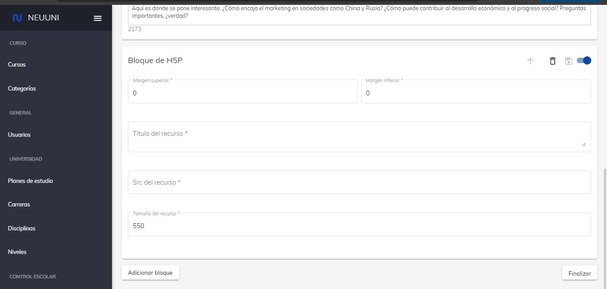
    7. Ingrese la URL del recurso y el nombre que llevara por defecto.
    8. De clic en guardar.
  </TabItem>
</Tabs>

## 2. Visualizaciones
_______________________________________________________________________________________

<Tabs>
  <TabItem value="vdo" label="Videos">
    1. Seleccione el curso donde deseé visualizar el video.
    2. De clic en el icono de editar que aparece sobre la sección de clase virtual.
    3. Seleccione la pagina donde se encuentre el video.
    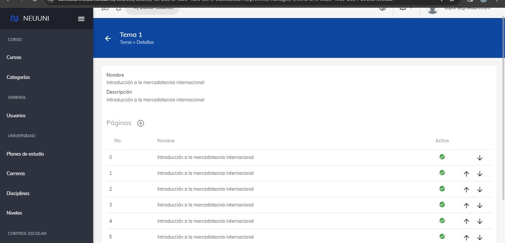
    4. De clic en reproducir.
    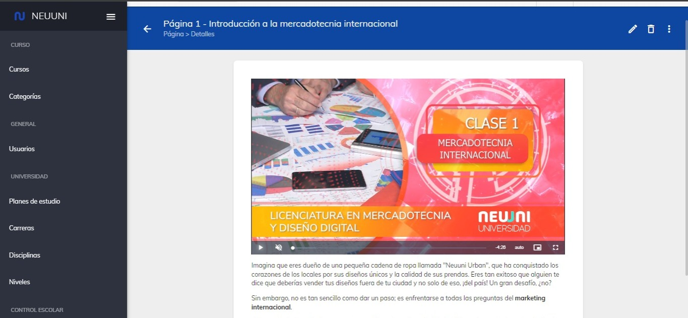
  </TabItem>
  <TabItem value="ado" label="Audios">
    1. Seleccione el curso donde deseé visualizar y reproducir el audio.
    2. De clic en el icono de editar que aparece sobre la sección de clase virtual.
    3. Seleccione la pagina donde se encuentre el audio.
    
    4. De clic en reproducir.
  </TabItem>
  <TabItem value="rec" label="HP5">
    1. Seleccione el curso donde deseé visualizar el recurso HP5. 
    2. De clic en el icono de editar que aparece sobre la sección de clase virtual.
    3. Seleccione la pagina donde se encuentre el video.
    
    4. Interactue con el recurso.
    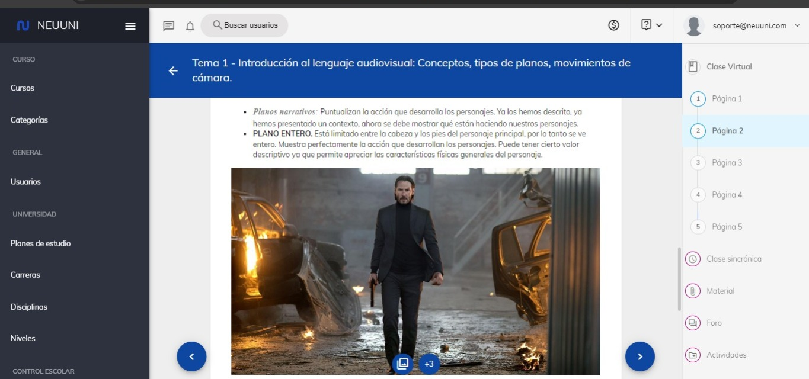
  </TabItem>
</Tabs>

## 3. Material de apoyo
_______________________________________________________________________________________
<Tabs>
  <TabItem value="MDA" label="Adicionar material de apoyo">
    Como adicionar una sección de "Material de apoyo".
    1. Seleccione el curso que deseé editar.
    2. De clic en el icono que se encuentra sobre el apartado de "Material de apoyo".
    3. Dependiendo que es lo que quiera adicionar; De clic en el boton "Adicionar Archivo" o "Adicionar enlace".
     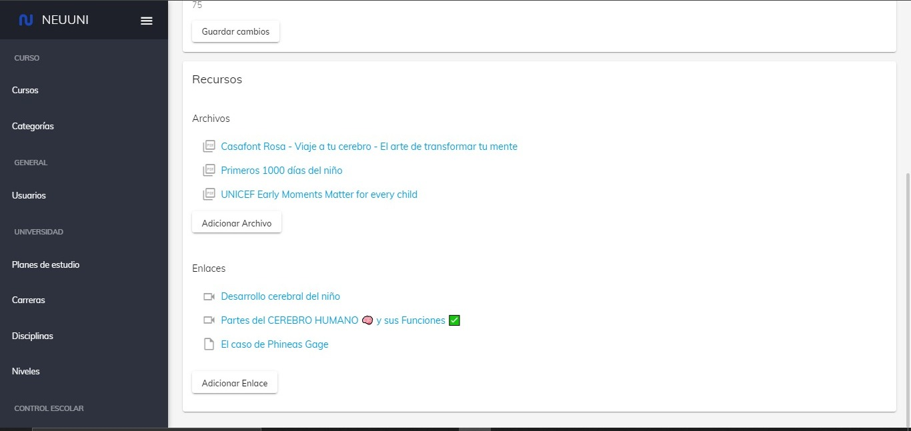
    4. Suba el archivo.
    5. De clic en guardar.
  </TabItem>
  <TabItem value="ims" label="Imagenes">
    Adicionar imagenes en la sección de material de apoyo.
    1. Seleccione el curso.
    2. Seleccione el tema del curso.
    3. De clic en el icono de editar que se encuentra sobre el apartado de "Material de apoyo".
    4. De clic en "Agregar documento".
    
    5. Seleccione la imagen a subir.
    6. De clic en guardar.
  </TabItem>
  <TabItem value="enl" label="Enlaces">
    Adicionar enlaces en la sección de material de apoyo.
    1.  Seleccione el curso.
    2. Seleccione el tema del curso.
    3. De clic en el icono de editar que se encuentra sobre el apartado de "Material de apoyo".
    4. De clic en agregar enlace.
    
    5. Coloque el enlace.
    6. De clic en guardar.
  </TabItem>
  <TabItem value="dcs" label="Documentos">
    Adicionar enlaces en la sección de material de apoyo.
    1.  Seleccione el curso.
    2. Seleccione el tema del curso.
    3. De clic en el icono de editar que se encuentra sobre el apartado de "Material de apoyo".
    4. De clic en agregar documento.
    
    5. Seleccione el documento.
    6. De clic en guardar.
  </TabItem>
</Tabs>

## 4. Foro
_______________________________________________________________________________________
<Tabs>
  <TabItem value="fro" label="Adicionar Foro">
    Como adicionar una sección de "Foro".
    1. Seleccione el curso que deseé editar.
    2. De clic en el icono que se encuentra sobre el apartado de "Foro".
    3. Dependiendo que es lo que quiera adicionar; De clic en el boton "Adicionar Archivo" o "Adicionar enlace".
     
    4. Suba el archivo.
    5. De clic en guardar.
  </TabItem>
  <TabItem value="imgs" label="Imagenes">
    Adicionar imagenes en la sección de Foro.
    1. Seleccione el curso.
    2. Seleccione el tema del curso.
    3. De clic en el icono de editar que se encuentra sobre el apartado de "Foro".
    4. De clic o arrastre la imagen en la sección de imagenes.
    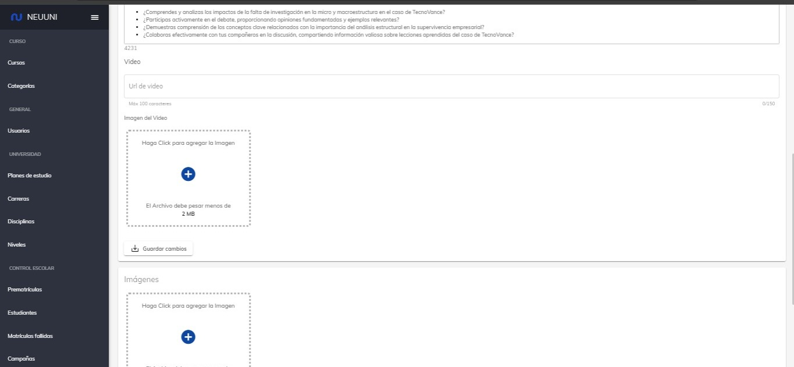
    5. Seleccione la imagen a subir.
    6. De clic en guardar.
  </TabItem>
  <TabItem value="enlc" label="Enlaces">
    Adicionar enlaces en la sección de "Foro".
    1. Seleccione el curso.
    2. Seleccione el tema del curso.
    3. De clic en el icono de editar que se encuentra sobre el apartado de "Foro".
    4. De clic en agregar enlace.
    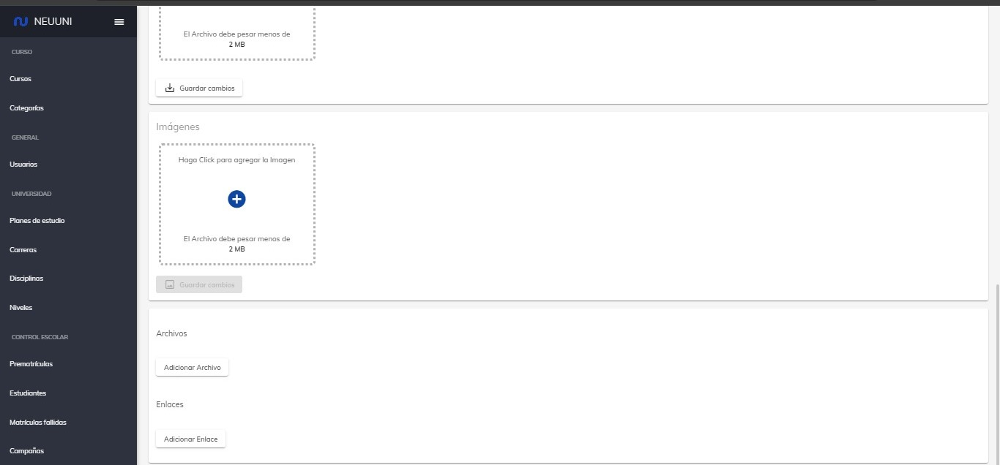
    5. Coloque el enlace.
    6. De clic en guardar.
  </TabItem>
  <TabItem value="dcus" label="Documentos">
    Adicionar enlaces en la sección de "Foro".
    1.  Seleccione el curso.
    2. Seleccione el tema del curso.
    3. De clic en el icono de editar que se encuentra sobre el apartado de "Foro".
    4. De clic en "Agregar documento".
    
    5. Seleccione el documento.
    6. De clic en guardar.
  </TabItem>
  <TabItem value="txts" label="Texto">
   Adicionar cuadro de texto dentro del Foro.
   1. Seleccione el curso.
   2. Seleccione el tema.
   3. De clic en el icono de editar que se encuentra sobre el apartado de "Foro".
   4. Ingrese el texto que deseé dentro del rectangulo.
   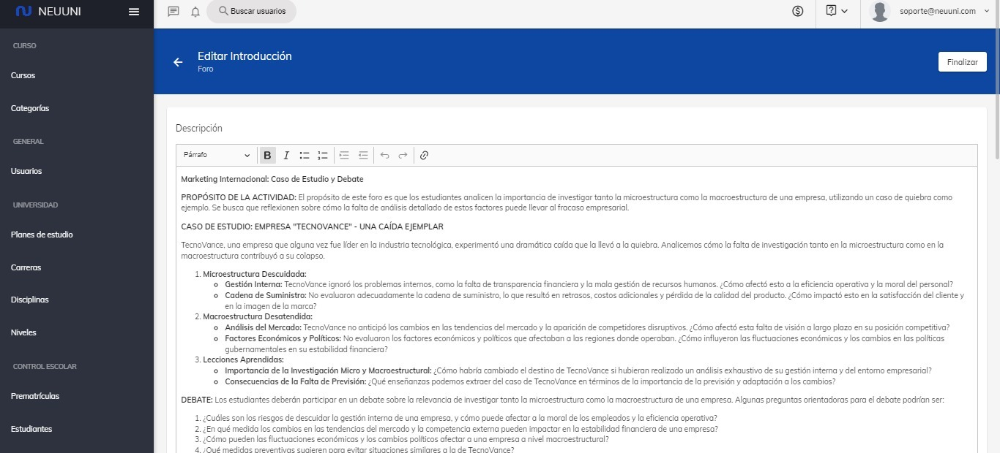
   5. De clic en "Guardar".
  </TabItem>
  <TabItem value="txtdo" label="Video">
Adicionar cuadro de texto dentro del Foro.
   1. Seleccione el curso.
   2. Seleccione el tema.
   3. De clic en el icono de editar que se encuentra sobre el apartado de "Foro".
   4. Ingrese el URL del video.
   5. De clic o arrastre una imagen representativa debajo de la URL.
   
   6. De clic en "Guardar".  
   </TabItem>
</Tabs>

## 5. Tareas
_______________________________________________________________________________________
<Tabs>
<TabItem value="tra" label="Tarea">
  Como adicionar una tarea.
  1. Seleccione el curso.
  2. Seleccione el tema donde deseé agregar una nueva tarea.
  3. De clic en el apartado de agregar actividad
      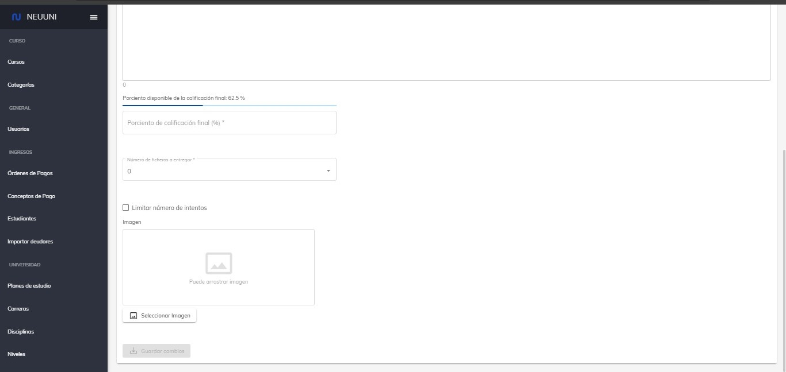
  4. Ingrese la introducion de la actividad asi como sus materiales de apoyo.
  5. De clic en guardar.
  </TabItem>
  <TabItem value="MDAI" label="Imagen">
   Adicionar una imagen dentro de una actvidad.
   1. Seleccione el curso.
   2. Seleccione el tema.
   3. De clic en el icono de editar actividad.
   4. De clic en agregar imagen o arrastre directamente la imagen.
   
   5. De clic en guardar.
  </TabItem>
  <TabItem value="ims" label="Texto">
  Añadir texto dentro de la actividad.
   1. Seleccione el curso.
   2. Seleccione el tema.
   3. De clic en el icono de editar actividad.
   4. Coloque su texto en el apartado con nombre "Parrafo"
   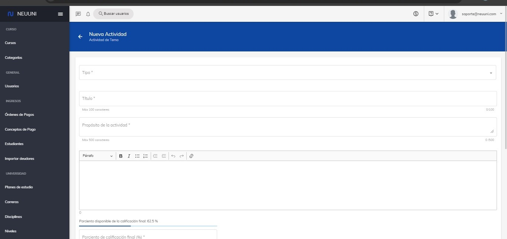
   5. De clic en guardar.
  </TabItem>
  <TabItem value="enl" label="Archivos">
  Adicionar archivos dentro de la actividad.
  1. Seleccione el curso.
  2. Seleccione el tema.
  3. De clic en el icono de editar actividad.
  4. De clie en el boton con nombre de "Agregar archivos".
    
  5. De clic en "Guardar"
  </TabItem>
  <TabItem value="dcs" label="Enlaces">
  Añadir enlaces dentro de la actividad.
  1. Seleccione el curso.
  2. Seleccione el tema.
  3. De clic en el icono de editar actividad.
    
  4. De clic en el boton de agregar documento.  
  </TabItem>
  <TabItem value="Its" label="Intentos">
  Añadir mas intentos a las tareas.
  1. Seleccione el curso.
  2. Seleccione el tema.
  3. De clic en el icono de editar activiadad.
  4. Marque la casilla de "limitar intentos".
  Le aparecera un rectangulo donde le pedira colocar el numero de intentos
    
  5. Coloque el numero de intentos.
  4. De clic en guardar.  
  </TabItem>
  <TabItem value="Porcentaje" label="Porcentaje">
    Colocar porcentaje de la actividad.
  1. Seleccione el curso.
  2. Seleccione el tema.
  3. De clic en el icono de editar actividad.
  4. Dirijase al campo de porsentaje.
  5. Coloque el porcentaje que llavara.
  
  6. De clic en guardar.
  </TabItem>
</Tabs>

## 6. Agregar Alumno
_______________________________________________________________________________________
<Tabs>
<TabItem value="tra1" label="Agregar Alumno">
Como agregar una alumno a un curoso.
   En construcción
  </TabItem>
</Tabs>

