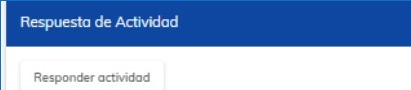
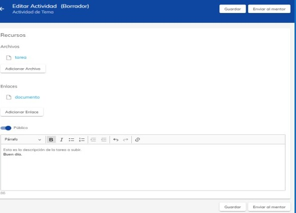

# Envio de actividades

Lo primero que deveras hacer, es iniciar sesión en la plataforma de NEUUNI con la siguiente liga:
https://cursos.unineuuni.edu.mx/

Una vez hayas iniciado sesión y seleccionado un tema, podrás apreciar distintos apartados de los 
cuales se compone cada uno de los temas dentro de un curso. Seleccionas el apartado con el 
nombre “Tarea”.

Al ingresar podrás observar el nombre del curso junto al nombre del mentor. Debajo hay un apartado 
principal donde podrás conocer detalles sobre la tarea a realizar al igual que los criterios de 
evaluación y puntos que debe llevar.

Debajo del apartado principal encontraras un 
apartado donde podrás subir la tarea o actividad.

Cuando des clic en el botón de responder actividad, nos dirigirá a una ventana donde tendremos que 
subir los archivos. 

En este apartado podrás subir tu tarea además de adjuntar enlaces y colocar descripciones.

Cuando estes listo de cargar tus documentos, al final encontraras 2 botones, uno donde podrás
guardar tu tarea como borrador y el otro es para enviar la tarea directamente al mentor. También
podrás encontrar estos mismos botones en la parte superior de la izquierda.

El encabezado muestra el número de intentos para poder enviar la tarea, esto debido al criterio del 
mentor el cual puede evaluar tu actividad como “incompleta” por lo que deberás volver a realizarla.

Si tienes una tarea con mala calificación se verá reflejado con un pulgar 
hacia abajo. Arriba, a un lado de la información viene la opción 
Retroalimentación, en la cual el docente recomienda al estudiante las 
áreas de mejora, reconoce la calidad de su trabajo, indica qué y por 
qué debe mejorarlo. Este apartado siempre debe ser completado por el 
docente

Por otro lado si realizas tu tarea correctamente, el mentor te calificara 
tu actividad como aprobatoria y en este caso podrás ver en la parte 
lateral un espacio que muestra si tu actividad realizada es aprobatoria.

