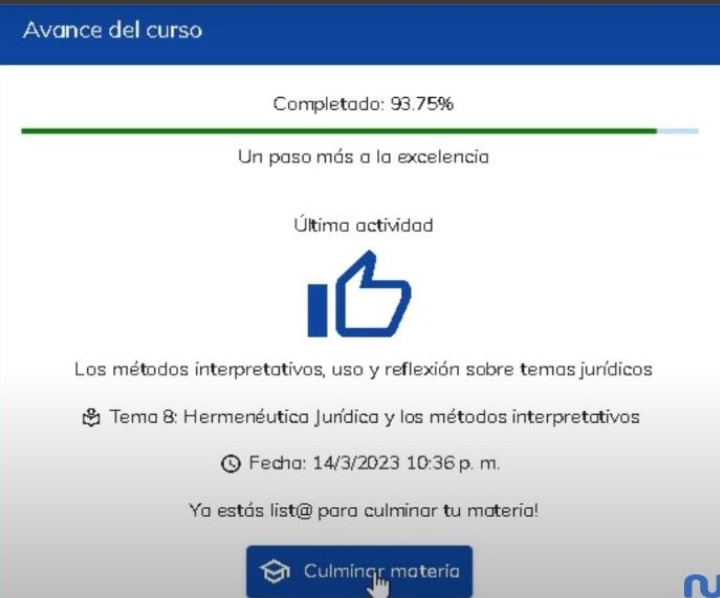
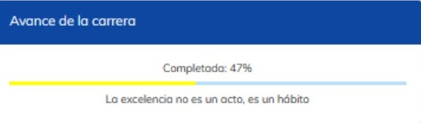
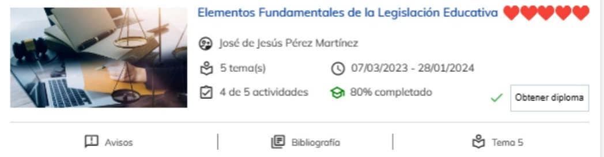
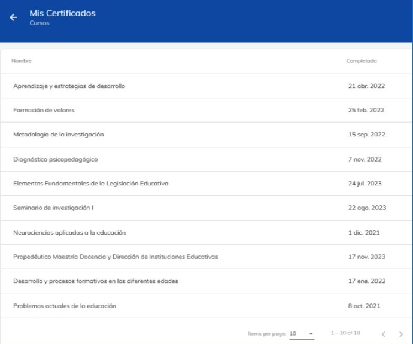
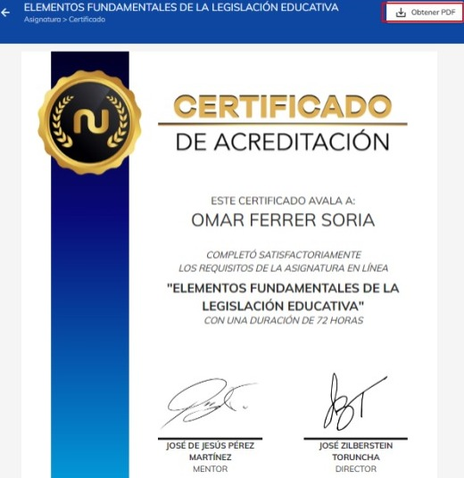

# Generación de certificados

Para poder ser acreedor a un certificado, es importante haber completado el 80% del curso. El 
progreso de los cursos se basa en los distintos temas que hayas completando a lo largo del curso. 

Cada que completes un tema del curso, podrás apreciarlo marcado como completado.

Para culminar una materia, selecciona la materia que quieras acabar y en la parte lateral derecha podrás ver diferentes paneles.

Dirigirte al panel que dice “Avance del curso” y da clic en culminar materia

Al dirigirte al panel principal, podrás ver que el avance de  tu carrera aumento, que en el curso aparece un botón donde podrás descargar tu diploma.

Podrás ver el progreso en porcentaje del curso además de todas las actividades realizadas y el numero de temas que contiene. Al completar satisfactoriamente el 80% o más, aparecerá un botón con nombre “Obtener diploma”.

Al dar clic en el botón, te redireccionara a otra página donde podrás ver y descargar tu  diploma.

En el menú lateral, tendrás un apartado con el nombre ”Mis certificados”, aquí encontraras todos los certificados de los cursos que has completado con éxito.

Puedes descargar tus certificados las veces que desees y en cualquier
momento.

