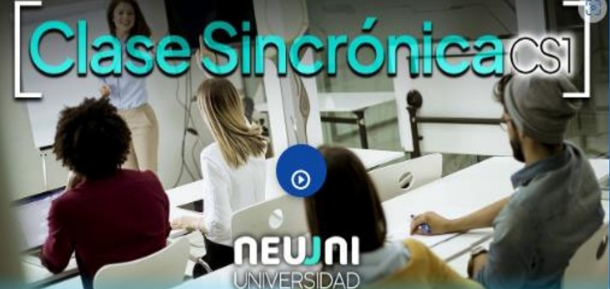
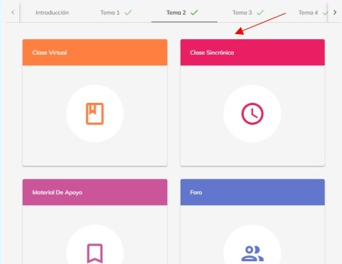
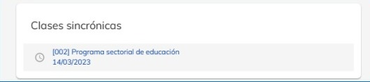
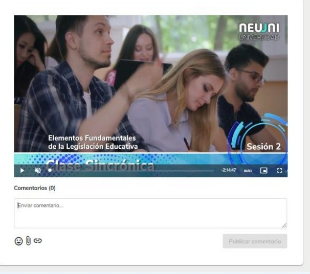

# Clase sincronica

Las clases sincrónicas tienen la finalidad de asegurar la interacción entre los mentores y estudiantes 
en tiempo real.

En la clase sincrónica se abordan explicaciones y demostraciones de contenidos y procedimientos 
prácticos sustantivos del tema, además se generan actividades que facilitan la interrelación de los 
estudiantes, como son el trabajo entre pares, pequeños grupos y en plenarios.

La clase sincrónica se organiza en cuatro momentos, apertura, desarrollo, cierre y atención diferenciada a los alumnos que lo precisen.

Al término de la clase sincrónica se da una atención diferenciada a los estudiantes que lo requieran, los cuales permanecen con el mentor por un espacio de hasta 30 minutos.

La duración de la clase sincrónica es de una hora y media con todo el grupo y los 30 minutos de  atención diferenciada, según se precise.

***¿Cómo puedo acceder a las clases sincrónicas grabadas de los cursos?***

Dentro de la plataforma ingresa al curso que desees para después seleccionar el tema.

Dentro del tema seleccionado podrás observar los distintos apartados del número de tema que seleccionaste. Hay una sección con el nombre de “Clase sincrónica”, donde podrás visualizar la clase sincrónica grabada las veces que desees y en cualquier momento.

Al seleccionar la clase grabada, podrásver el contenido audio visual, además de poder comentar a través de texto imágenes e incluso enlaces y documentos.

Las clases sincrónicas actualmente se están realizando por Google Meet, para acceder a esa opción 
se debe de tener a la mano el correo institucional proporcionado por Neuuni.
