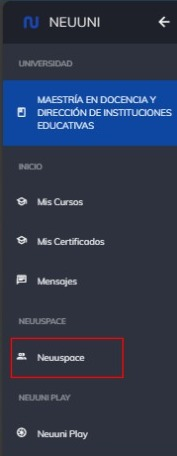
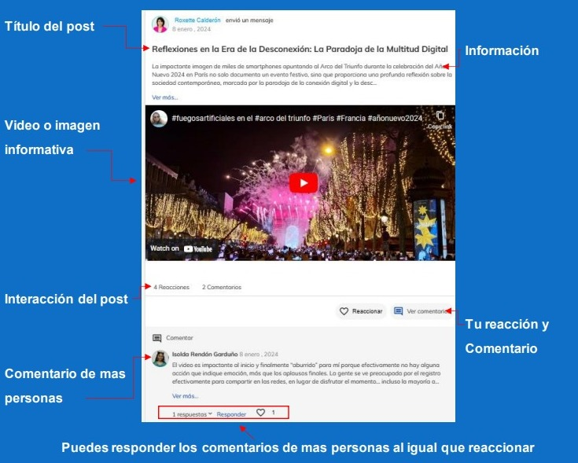

# Neuuni Space

Dentro de la plataforma de Neuuni podrás encontrar un espacio diseñado para ti, donde podrás
conocer, interactuar y conectar con tu comunidad, además podrás platicar con personas de todo 
México y Latinoamérica para conocer nuevas perspectivas sobre los distintos temas dentro de este
espacio.

**¿Cómo accedo a neuuni space?**
Inicia sesión en la plataforma de Neuuni con tu cuenta de correo institucional.

Una vez hayas ingresado, tendrás un menú en la parte lateral de la izquierdadonde podrás ver distintos apartados que se encuentran en plataforma.

Para ingresar a este apartado, deberás dirigirte al menú principal de la 
plataforma, y una vez dentro, podrás observar un menú en la parte lateral 
izquierda como se muestra en la siguiente imagen:

Al ingresar en este apartado, aparecerán distintas categorías con las cualespodrás interactuar de distintas formas.

Selección la que más te llame la atención para mantenerte  informado.

Puedes interactuar con los posts que se encuentran en cada categoría.

