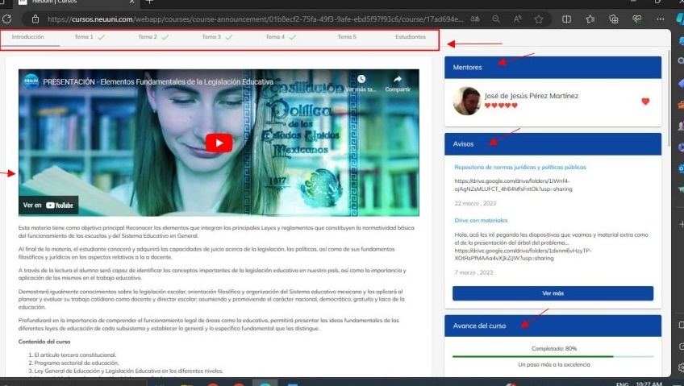

# Uso del foro

En este tutorial aprenderás a usar el foro que se encuentra dentro de la plataforma de NEUUNI.

### Paso 1
Ingresara la plataforma con tu correo institucional dando clic en el botón
de “continuar con google”.

Una vez hayas ingresado, podrás observar la pantalla inicial donde se muestra una barra lateral de 
navegación y el contenido principal, donde destacan las materias que se están cursando y el avance 
de la carrera.

##### NOTA: Los foros sé encuentran dentro de cada curso que tengamos.
### Paso 2 
Para ingresar a los cursos, puedes seleccionarlos desde la pantalla principal como se marca con la 
flecha, o bien, puedes dirigirte a la barra de navegación lateral y seleccionar el apartado de “Mis 
cursos”

### Paso 3

Dentro del curso, seleccionamos el tema que queramos u ocupemos.

### Paso 4

Después de seleccionar el tema, se mostrará la siguiente pantalla donde podrás ver los distintos 
apartados del curso.

### Paso 5

Seleccionamos dando clic en el apartado con el nombre de “Foro”

Al entrar al foro, podrás observar distintos elementos:
1. Muestra un apartado informativo acerca del tema seleccionado.
2. En este apartado se observa la actividad reciente de las distintas personas las cuales han 
comentado dentro del foro.
3. Aquí es donde podrás compartir tu opinión a través de texto, imágenes, enlaces e incluso 
subir documentos.
4. Podrás visualizar las publicaciones de las demás personas. 
También podrás interactuar comentando o danto “Me gusta” pulsando el corazón que se 
aprecia en la parte inferior de la derecha.
