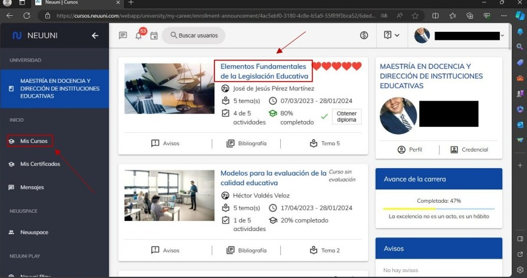
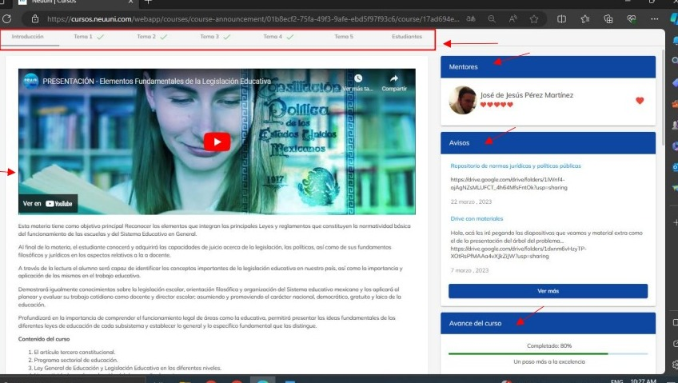
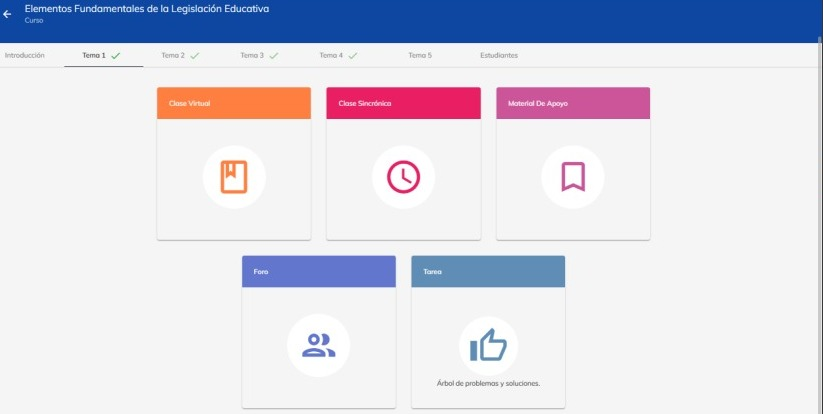

# Elementos de un curso

Para ingresar a un curso, hay 2 maneras de hacerlo:
1. Ingresa seleccionando el curso como se señala con la flecha 1.
2. Dirígete a el menú lateral izquierdo y selecciona el apartado con el nombre “Mis cursos”, una 
vez dentro, podrás observar todos los cursos en los cuales estas inscrito.

Al ingresar al curso, se observará la pantalla inicial del curso donde a primera vista podrás observar 
una barra superior que nos indica en que apartado estamos, la cual contiene los temas y los 
estudiantes inscritos en el curso.

En la siguiente imagen se muestra el apartado de “Introducción” en la cual podemos observar distintos 
elementos.

La pantalla que se muestra en el apartado de introducción, contiene un video de presentación del curso junto con una introducción.

En la parte lateral derecha podemos observar el nombre del mentor que imparte el curso. Además de poder apreciar su calificación y asimismo darle aprobación. Debajo podrás ver los avisos que coloca 
el mentor y mas abajo veras el avance que llevas del curso.

Al ingresar al tema seleccionado podrás ver distintos apartados de los cuales se compone cada tema.

Clase virtual: Aquí podrás consultar toda la información y actividades del tema.
Clase sincrónica: En este apartado podrás ver la clase grabada las veces que desees.

Material de apoyo: Para reforzar tu conocimiento podrás seleccionar este apartado y consultar 
distintos tipos de material que te harán complementar tu entendimiento.

Foro: Si quieres compartir tu opinión a través de texto, imágenes, enlaces o documentos, puedes 
ingresar al foro y compartirla, al igual que ver las distintas opiniones de los demás participantes.

Tarea: En este apartado, el mentor asignara distintas tareas las cuales deveras realizar para aumentar
el avance del curso.