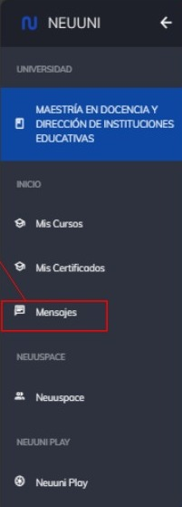
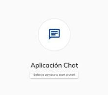
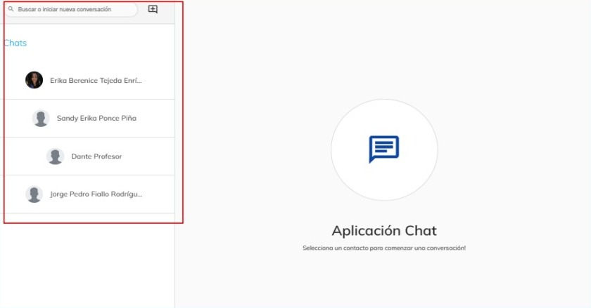
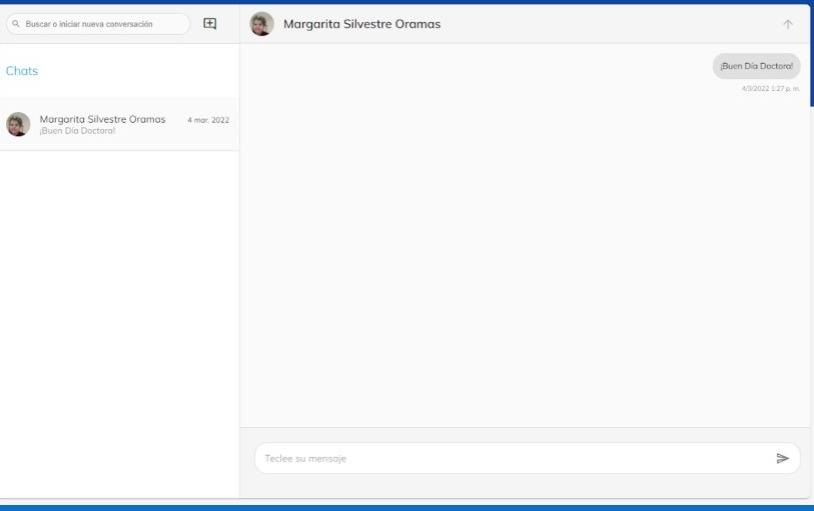

# Envio de mensajes

Al ser una universidad únicamente en línea, entendemos que pueda ser difícil la comunicación entre 
estudiantes y docentes. Por lo tanto, dentro de la plataforma encontraras un espacio donde podrás
conversar con los estudiantes y mentores con los que compartes cursos.

### Paso 1
Para ingresar a este apartado, deberás dirigirte al menú principal de la 
plataforma, y una vez dentro, podrás observar un menú en la parte 
lateral izquierda

Selecciona la opción con el nombre “Mensajes”.

### Paso 2
Al ingresar, veras una pantalla 
principal con un botón para iniciar
una nueva conversación.
En este espacio podrás ver todas 
las conversaciones que tengas
posteriormente

### Paso 3
Encontraras una lista de los distintos usuarios y mentores donde podrás acceder con un solo clic.
Dentro de tu espacio de menajes, habrá un buscador para que puedas localizar a algún compañero o 
mentor de la manera más rápida posible.

### Paso 4
Para crear una nueva conversación solo tienes que dirigirte a la esquina superior izquierda y 
seleccionar le botón de mas

Al seleccionar un contacto, podrás enviar mensajes a través de texto, imágenes e incluso documentos.
