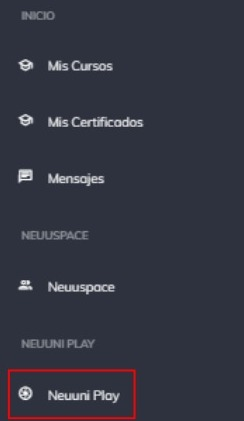
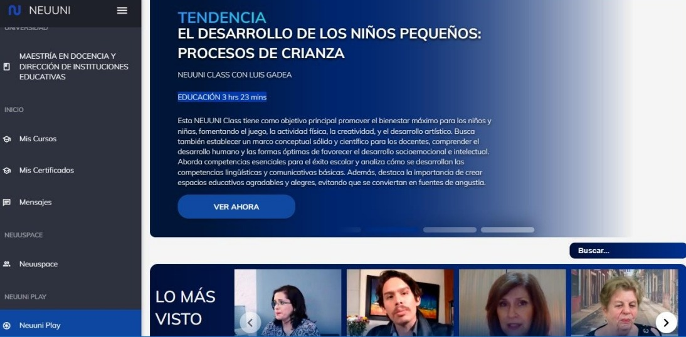
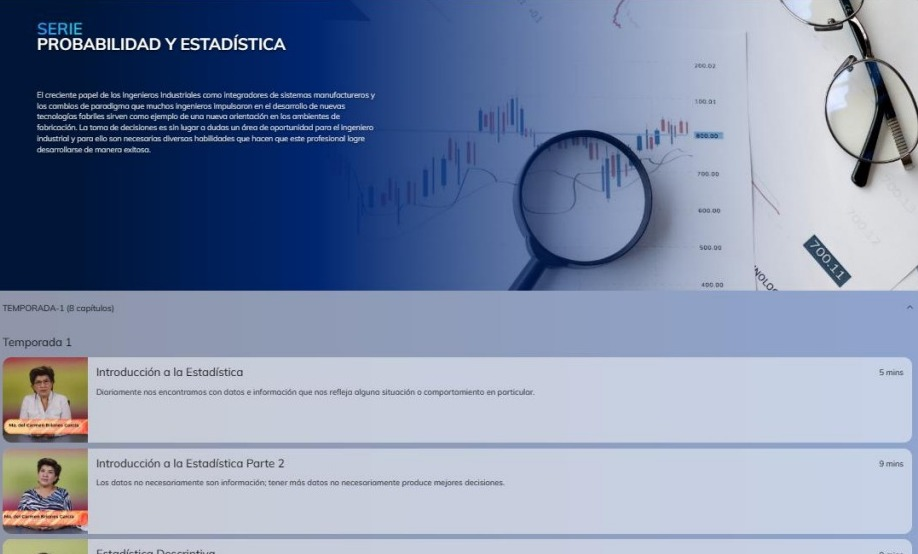

# Neuuni Play

Neuuni play es un espacio donde encontraras distintas series de videos de diferentes categorías en 
tendencia. Encontraras temas como ciencia, tecnología, educación, negocios, investigación, 
psicología, etc.

#### ¿Cómo accedo a Neuuni Play?
Tendrás un menú en la parte lateral de la 
izquierda donde podrás ver distintos apartados que se encuentran en 
plataforma.

Para ingresar a Neuuni PLAY, deberás dirigirte al menú principal de la 
plataforma, y una vez dentro, podrás observar un menú en la parte lateral 
izquierda como se muestra en la siguiente imagen:

Al ingresar a Neuuni play podrás observar todas las listas de reproducciones de los distintos temas.

El banner principal, muestra los temas que este en tendencia durante ese momento y debajo de este 
mismo, puedes acceder a los videos y lista de reproducciones con más vistas.

Si no encuentras el tema que desees, puedes buscarlo con el botón que se encuentra en la parte 
inferior de la derecha con color azul.

Desliza hacia abajo para poder ver la lista de reproducciones de todas las categorías disponibles

La seleccionar un tema, nos abrirá una nueva ventana donde podremos ver información sobre la serie
y así mismo el numero de temporadas y sus capítulos.

Pulsa en cualquier capitulo para comenzar a aprender y así expandir más y más tu conocimiento.
