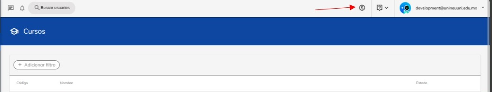
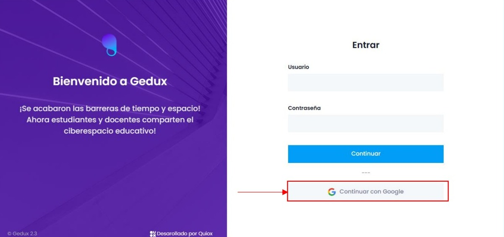
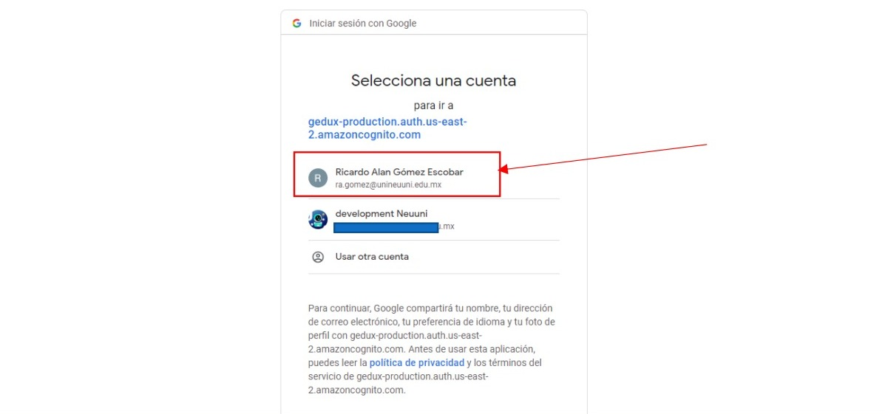
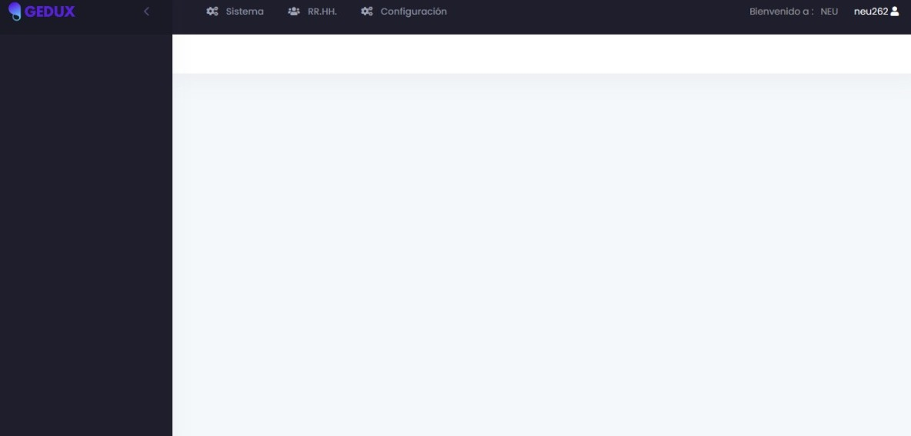

# Ingresar a la plataforma de pago

En este tutorial podrás conocer como ingresar a la plataforma de pagos con tu cuenta 
institucional.

### Paso 1
Ingresa a la plataforma de Neuuni con tu cuenta institucional.

### Paso 2
Dentro de la plataforma dirigirte a la sección superior, para acceder a la plataforma de pagos 
selecciona el botón con el símbolo de dinero.

### Paso 3 

Una vez dentro, tendrás que ingresar nuevamente con tu correo institucional dando clic en el botón
para ingresar con Google.

### Paso 4
Al dar clic aparecerá una ventana donde nos preguntará con que cuenta queremos ingresar.

### Paso 5
Seleccionamos la cuenta institucional y automáticamente podremos acceder a la plataforma de pagos.

