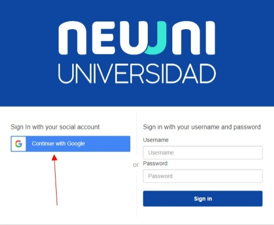
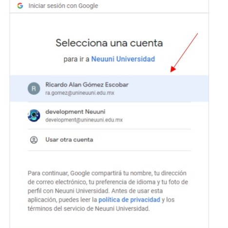

# Ingresar a la plataforma

### Paso 1
1. Ingresa a la plataforma de Neuuni en la dirección: cursos.unineuuni.edu.mx 

Al ingresar podrás visualizar la siguiente pantalla donde deberemos dar clic en **Continuar con google**:

### Paso 2
2. Al dar clic, nos abrira una ventana donde deberemos seleccionar nuestra cuenta institucional. 

### Paso 3
3. Seleccionamos nuestra cuenta institucional. Si no aparece tu cuenta, da clic en “Usar otra cuenta” e 
ingresa tu cuenta institucional.

Una vez seleccionada tu cuenta, podrás ingresar a la plataforma de Neuuni.

###### NOTA: Si al ingresar, se queda la pantalla de carga congelada, solo refresca la página