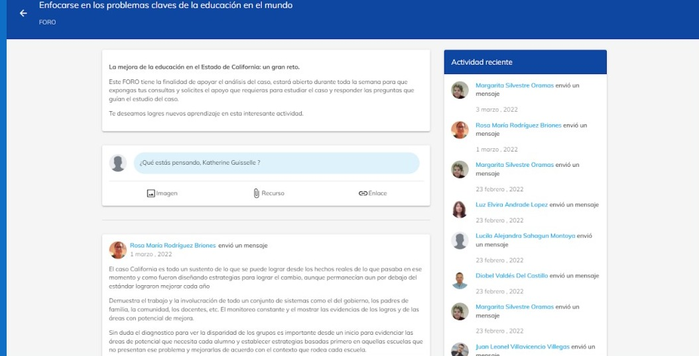
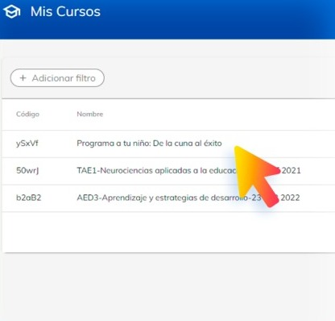
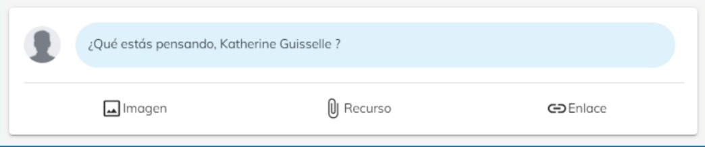

# Uso del Foro

En esta guía, aprenderás 
sobre Información sobre Foro, Publicar, Dejar comentario.

Los foros se encuentran dentro de todos los cursos y son parte importante de apoyo en la actividad de 
cada semana.

El foro es un espacio que propicia la interacción reflexiva de los estudiantes entre sí y con el mentor.

El foro es una vía de comunicación entre los estudiantes, donde expresan sus puntos de vista, sus 
ideas, sus dudas, convirtiéndose en una rica actividad de aprendizaje.

### ¿Cómo acceder?

1. Dirígete al curso que administras.

2. Selecciona el tema donde se encuentra ubicado el foro.

3. Selecciona el modulo de foro

**Participación del mentor en el foro.**

El mentor además de diseñar el foro, cuando este se activa y empiezan las participaciones de los 
estudiantes, va a jugar un papel fundamental de mantener la discusión activa y fomentar la respuesta 
de unos alumnos a otros, percatarse de cuando es necesario cambiar el objeto de discusión, de forma 
que para el estudiante el foro signifique un momento importante en su aprendizaje.

**▪ Responder a un alumno**
Para comentar a un alumno en particular al final del escrito del alumno va a encontrar la palabra 
"comentar", en la que al presionar aparece un espacio para escribir la respuesta al estudiante en 
particular, aunque todos tienen la posibilidad de leerla.

**Añadir una contribución**

Si el mentor necesita hacer una retroalimentación, cuestionar al grupo, redireccionar el foro o hacer un 
comentario de conclusión acerca del contenido que se está discutiendo, lo realizará en la parte superior 
del foro donde encontrará un apartado para escribir con la leyenda de "¿Qué estás pensando?".