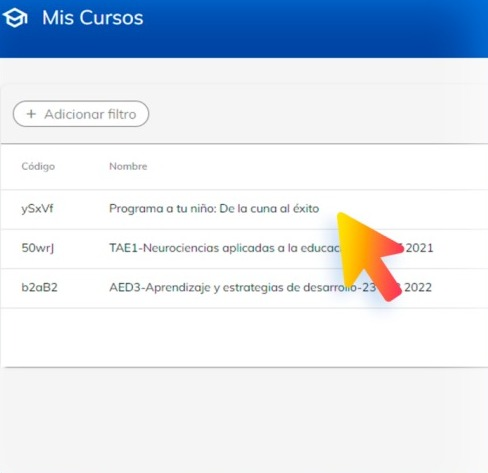

# Aperturas de un curso 

En esta guía, aprenderás a visualizar las aperturas clave dentro de los cursos.

Dentro de la plataforma, dirígete al menú que se encuentra en la parte
lateral de la derecha y selecciona el apartado con el nombre de “Mis 
cursos”.

Una vez dentro, podrás visualizar todos los cursos que impartirá.

Seleccione el que requiera para visualizar el contenido del curso.

Al abrir el curso podrá observar una pantalla de introducción donde contiene una descripción del curso.

1. En este menú superior podrás navegar de tema en tema o visualizar a los estudiantes que 
estén dentro del tema.

2. En este apartado podrás colocar avisos para todos los alumnos dentro del curso.
3. Da clic en el símbolo: ´+´ para agregar avisos.

4. En esta sección, como su nombre lo indica, podrás ver detalles adicionales al curso.

5. Dentro de cada tema podrás encontrar distintas secciones de las cuales se compone un 
curso.

