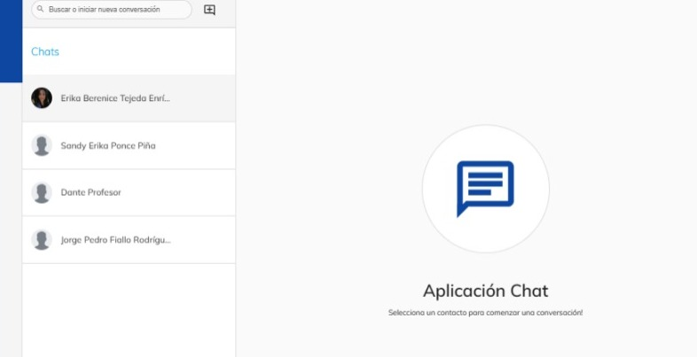

# Buscar Usuarios

En esta guía, aprenderás a como buscar usuarios dentro de la plataforma de Neuuni.

Una vez dentro de la plataforma, podrá visualizar acerca de las distintas partes de las cuales se 
compone la plataforma.

En la parte superior, podrá encontrar distintos accesos directos, donde podrá acceder directamente a 
sus mensajes, notificaciones y webinars.

Además, al lado derecho de estos accesos directos, se encontrará un apartado donde podrá buscar 
usuarios.

Al presionar el botón de buscar usuarios, se mostrará una ventana con una lista de sugerencias y 
una barra de búsqueda donde podrá filtrar la búsqueda.

Cuando seleccione la persona que desee, podrá ver su perfil.

Para enviar mensajes, diríjase a la sección de mensajes, y busque a la persona la cual le enviara 
mensajes dando clic en el botón con el símbolo ”+” para iniciar una nueva conversación.

Para encontrar usuarios los cuales están inscritos a un curso, seleccione el curso que desee.

Dentro del menú que se encuentra en la parte superior, al final del menú, contendrá un apartado
llamado “Estudiantes”.

Dentro de este apartado, podrá encontrar a todos los estudiantes que se encuentren cursando la 
materia.

Aquí aparecerán todos los alumnos que estén dentro del curso, y en la parte superior se encontrará
una barra donde podrá buscar específicamente al alguien.

Al seleccionar al alumno, podrá visualizar el perfil del mismo y desde su perfil podrá enviar mensajes si desea.

