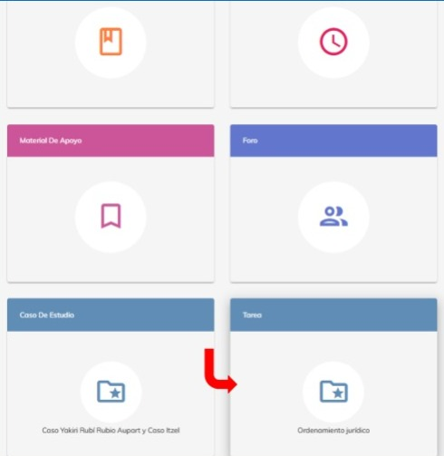
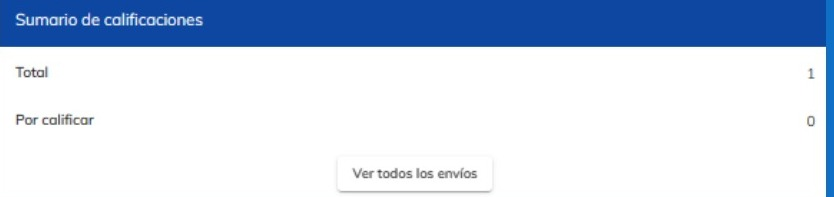
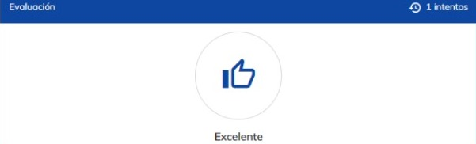
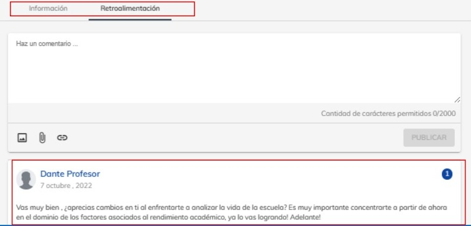

# Calificar tareas

En esta guía, aprenderás a calificar las tareas dentro de los temas en los cursos.

Empiece seleccionando el curso que desee. Al ingresar podrá visualizar información acerca del curso.

En la parte superior, se encontrará un menú donde podrá navegar de tema en tema, seleccioné el que 
deseé.

Dentro de cada tema podrá encontrar distintos apartados.

Seleccione el que apartado con el nombre de “Tarea”.

Dentro del apartado de tarea, podrá visualizar la descripción de la tarea a realizar, además de contener 
el número de los intentos.

Debajo de la información, se encontrará un apartado donde podrá visualizar el total de tareas 
entregadas, además de contener las tareas que faltan por calificar.

Al dar clic en el botón de “Ver todos los envíos” nos dirigirá a un listado todos los alumnos los cuales 
ya subieron sus tarea.

Al seleccionar el alumno que se desee calificar, podremos apreciar, el documentó de la tarea del 
alumno para poder descargarlo y visualizarlo y la fecha de entrega.

Debajo contentendra un apartado para calificar la tarea. Al tomar la tarea como excelente, se vera 
reflejado con un pulgar azul hacia arria, de lo contrario se marcará un el pulgar rojo hacia abajo.

Si el alumno tiene mala evaluación en su tarea, tendrá un intento mas para volver a realizar su tarea y 
nuevamente subirla.

En la parte superior encontrará un menú en el cual podrá navegar hacia la retroalimentación, donde 
usted podrá colocarle un comentario sobre la actividad al alumno, es importante que usted como 
mentor, siempre deje una retroalimentación a cada uno de los alumnos.

