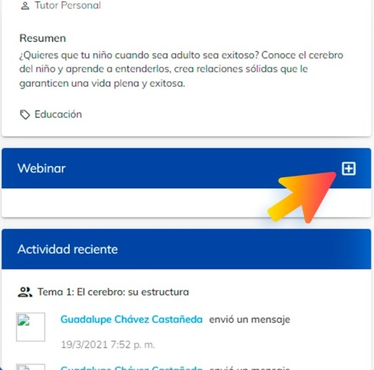

# Clase Sincrónica

En esta guía, aprenderás a grabar, agendar, activar imagen en imagen, hacer pequeños grupos, compartir carpeta de meet
recording.

Las clases sincrónicas tienen la finalidad de asegurar la interacción entre los mentores y estudiantes 
en tiempo real. En la clase sincrónica se abordan explicaciones y demostraciones de contenidos y 
procedimientos prácticos sustantivos del tema y se generan actividades que facilitan la interrelación 
de los estudiantes, como son el trabajo entre pares, en pequeños grupos y en plenarios.

La asistencia a las clases sincrónicas es obligatoria en más del 50% (cuatro en licenciatura y 3 en 
postgrado) y para lograrlo es muy importante la comunicación, orientación y significado que el 
docente de a esta actividad.

### ¿Cómo crear una clase sincrónica?

1. Dirígete a meet.google.com y selecciona "Nueva reunión".

2. Selecciona "Programar en Google Calendar".

3. Te abrirá una nueva pestaña donde podrás definir todos los aspectos técnicos de tu 
clase.

4. Asegúrate de tener activada la opción de "Unirme con Google Meet".

5. Copia la liga de la reunión.
 

6. Ahora colocarás esa liga en la plataforma, para ello vas a ir a tu curso en Neuuni.

7. Ahí te vas a dirigir a la parte inferior izquierda y vas a ubicar el apartado de "webinar"

8. Vas a crear un nuevo anunció de webinar, y para le vas a dar en el botón de [+]

9. Al finalizar de colocar todos los detalles, le vas a dar en guardar.
 
 

### ¿Cómo grabar una clase sincrónica?

1. Haz clic en Cambiar configuración de conferencia.

2. Haz clic en iniciar grabación.

3. Nuevamente haz clic en iniciar grabación.

4. Espere en lo que comienza la grabación.

5. Iniciará la grabación y podrá apreciara de la siguiente manera.

 
### ¿Cómo crear salas en grupo?

1. Haz clic en Cambiar configuración de conferencia.

2. A la izquierda, haz clic en Grupos de trabajo .
 Clases sincrónicas.

 

3. Elige el número de grupos de trabajo y, a continuación, elige una de estas opciones:
- Arrastra los participantes a diferentes salas.
- Introduce sus nombres directamente en una sala.
- Haz clic en Distribuir aleatoriamente para crear grupos de participantes mezclados 
al azar.

4. Haz clic en Guardar y veras los grupos ya creados.

### ¿Cómo compartir la grabación para editarla?

Las grabaciones se tardan aproximadamente de dos a tres horas en procesarse, una vez que se 
haya procesado te va a llegar un correo de confirmación cómo el siguiente.

1. La grabación se almacenará en el drive de la cuenta institucional del mentor, para 
verificarlo entra en drive.google.com.

2. Asegúrate de estar en tu cuenta institucional.

 

3. En la sección de "Mi unidad" se encuentra una carpeta llamada "Meet Recordings"

4. Presionando click derecho sobre la carpeta saldrá un panel de opciones, selecciona 
"compartir"

5. En la nueva ventana que le aparece ingrese el correo de:
- m.reynaga@unineuuni.edu.mx
- dy.cardenas@unineuuni.edu.mx
- m.gutierrez@unineuuni.edu.mx

6. Asegúrese de que en los permisos sean de Editor para poder descargar las clases

7. ¡Listo! El último paso es enviarlo

