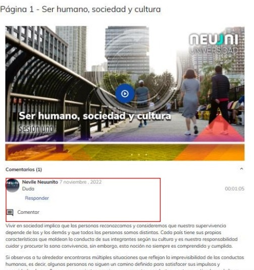

# Neuuni Connect

Neuuni Connect busca que los estudiantes sientan los mismos privilegios que sería tener al docente 
en casa, creando así una comunidad educativa que conecta a todos los estudiantes entre sí y entre 
sus mentores. Neuuni Connect es una herramienta automática que tiene como objetivo el poder aclarar 
dudas que existan dentro de las clases virtuales.

El principio básico es que dentro de los videos que se encuentran en la plataforma, el alumno puede 
ir viendo y analizando, si en algún momento el estudiante tiene una duda con respecto a lo que se está 
presentando en el video, puede detenerlo y hacer una pregunta en la caja de comentarios que está 
justo debajo del video.

El mentor puede ver estos comentarios e identificar en el minuto donde el alumno presenta la duda y 
darles una retroalimentación o explicación más concreta, haciendo así un tema más fluido, entendible 
para el estudiante.

Este espacio inspira a otros estudiantes a participar e interactuar, quienes al igual que el mentor 
expresan su punto de vista, intercambian, sugieren, exponen sus experiencias generándose una 
comunidad de aprendizaje en acción.

**¿Como accedo?**

Ingrese a la plataforma, seleccione el curso que desee. Al seleccionar el curso y 
luego seleccione el apartado de clase virtual.

Dentro de las clases virtuales podrás encontrar videos, en ocasiones los alumnos generaran dudas 
dentro del video, por lo que podrán comentar el video y su comentario aparecerá con el minuto 
donde comentaron.

Al visualizar el comentario, el mentor podrá responderle las dudas a través de texto, imágenes, 
documentos e incluso ligas.

De clic en en el botón de responder para poder comentarle en modo de respuesta.

Al terminar de escribir el comentario o subir imágenes, documentos, etc., De clic en el botón de 
publicar y automáticamente se publicará el comentario.