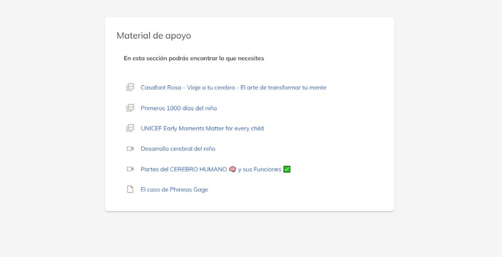

# Material de apoyo

Los materiales de apoyo son el complemento necesario que se incluye para la búsqueda de la 
información que el estudiante requiere con vistas al estudio del contenido de aprendizaje.

Se refiere a libros, revistas, antologías, artículos, videos, programas, presentaciones que se incluyen 
como parte de la bibliografía del curso, si son bajados de la red necesitamos incluir la referencia, puede 
ser la liga con la referencia que facilite la búsqueda por parte del estudiante.

En cada tema del curso se muestra la carpeta para incluir los materiales de apoyo que se requieren 
para el aprendizaje.

### ¿Como acceder?
1. Dirígete al curso que administras.

2. Selecciona el tema de donde quieras revisar el material

##### NOTA: Para agregar material de apoyo es necesario comunicarse con el área de academia.
