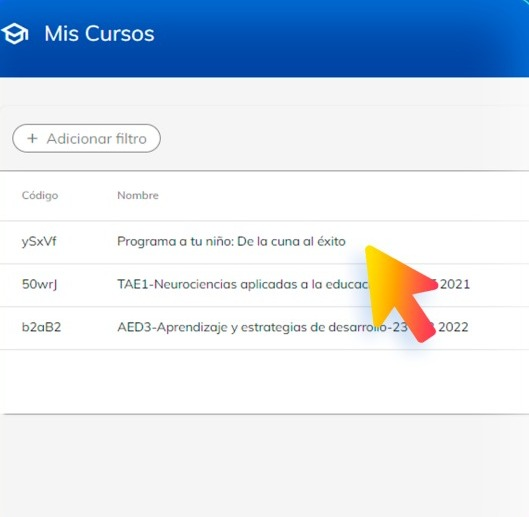
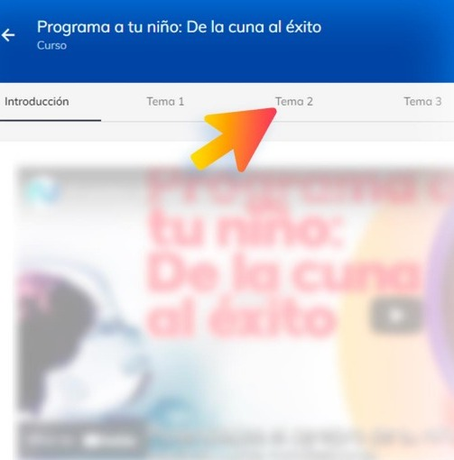
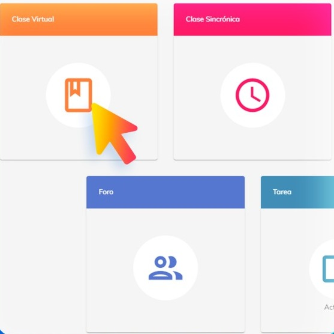

# Ver clases

El reto de la clase virtual es presentar la esencia de la teoría y el diseño de los procedimientos 
(habilidades) para su puesta en práctica, que es lo más difícil de transferir, más en corto tiempo y para 
que sea analizado por el estudiante de forma independiente.

La clase virtual requiere en su diseño el apoyo de imágenes y de videos, de forma asociada, lo cual 
es una exigencia para facilitar comprensión.

La clase virtual a la vez se constituye en una guía para el estudiante donde se orienta cómo y cuándo 
realizar una tarea, detenerse en el análisis de una imagen, analizar un artículo, observar y analizar un 
video o participar en un foro, por ejemplo.

## ¿Cómo acceder?

1. Dirígete al curso que administras.

2. Selecciona el tema donde se encuentra ubicada la Clase Virtual.

3. Selecciona el módulo de la Clase Virtual.

Dentro podrás ver y analizar todas las secciones y contenido multimedia con el que cuenta tu clase 
virtual. En caso de que quieras modificar alguna información puedes comunicarte con el área de 
academia.