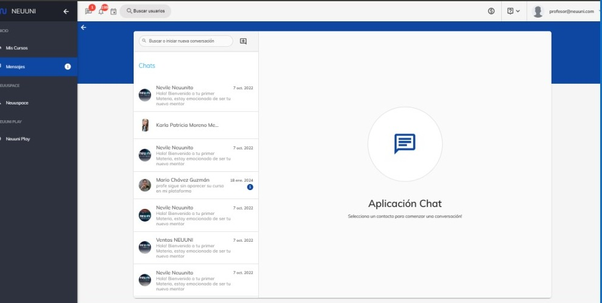
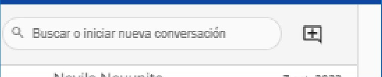
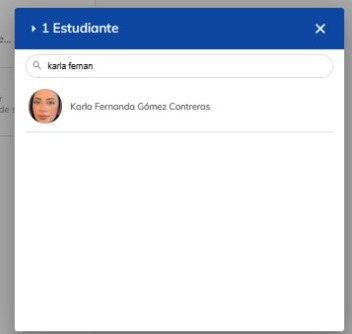
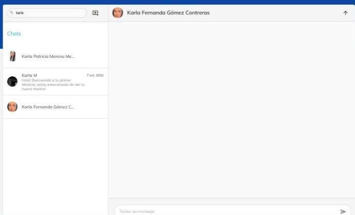

# Chat de la plataforma

Bienvenidos y gracias por formar parte del cambio en la educación actual, en esta guía, aprenderás a
visualizar conversaciones pasadas, buscar alumnos y crear nuevas conversaciones.

En la parte lateral izquierda, tendrá un menú, seleccione el apartado de 
“Mensajes.

Al ingresar, podrá apreciar la sección de mensajes como se muestra en la imagen de arriaba.

Para buscar conversaciones pasadas, diríjase a la barra de búsqueda que se encuentra en la parte 
superior y coloque el nombre de la persona con la que tuvo contacto anteriormente.

Al escribir el nombre, empezaran a aparecer las personas relacionadas con la búsqueda.

Podrá visualizar la conversación al seleccionar el contacto.

Para iniciar una nueva conversación, de clic en el símbolo de “+“.
Aparecerá una ventada donde contendrá a distintas personas de sugerencia, si no se encuentra la 
persona deseada, tendrá una barra de búsqueda para que así pueda localizar con mayor facilidad.

Al seleccionar a la persona, se abrirá un chat nuevo con la persona seleccionada, donde podrá enviarle 
mensajes

