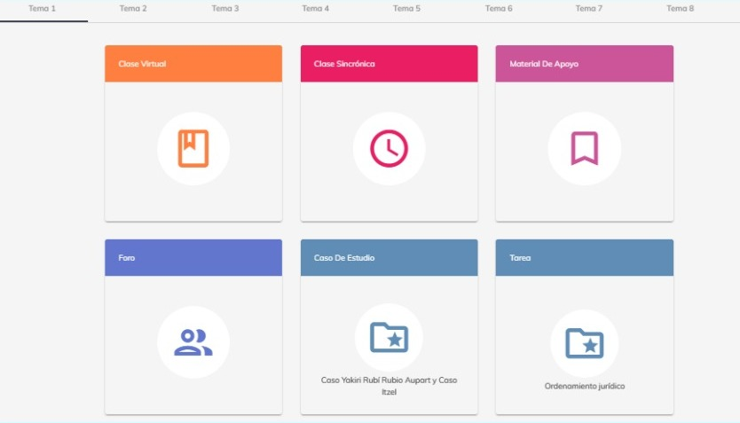

# Información sobre temas 

En esta guía, aprenderás sobre la información de los temas.

Como primer paso, seleccione el curso que desee. Al seleccionar el curso, podrá visualizar una 
introducción sobre el curso.

En la parte superior, se encontrará un menú donde podrá navegar a a través de los diversos temas.

Al seleccionar el tema que desee, podrá observar distintos apartados de los cuales se compone un 
tema.

### Clase virtual
 El reto de la clase virtual es presentar la esencia de la teoría y el diseño de los 
procedimientos (habilidades) para su puesta en práctica, que es lo más difícil de transferir, más en 
corto tiempo y para que sea analizado por el estudiante de forma independiente. La clase virtual 
requiere en su diseño el apoyo de imágenes y de videos, de forma asociada, lo cual es una 
exigencia para facilitar comprensión. Cada estudiante lee, analiza, observa las imágenes, el 
video, en la forma y número de veces que necesite, reflexiona, se apropia de ideas sustantivas.

### Clase sincrónica
 Las clases sincrónicas tienen la finalidad de asegurar la interacción entre los 
mentores y estudiantes en tiempo real. En la clase sincrónica se abordan explicaciones y 
demostraciones de contenidos y procedimientos prácticos sustantivos del tema y se generan 
actividades que facilitan la interrelación de los estudiantes, como son el trabajo entre pares, en 
pequeños grupos y en plenarios.

### Material de apoyo
 Los materiales de apoyo son el complemento necesario que se incluye para la 
búsqueda de la información que el estudiante requiere con vistas al estudio del contenido de 
aprendizaje.

Se refiere a libros, revistas, antologías, artículos, videos, programas, presentaciones que se incluyen 
como parte de la bibliografía del curso, si son bajados de la red necesitamos incluir la referencia, 
puede ser la liga con la referencia que facilite la búsqueda por parte del estudiante.

### Foro
 El foro es un espacio que propicia la interacción reflexiva de los estudiantes entre sí y con el 
mentor. El foro es una vía de comunicación entre los estudiantes, donde expresan sus puntos de 
vista, sus ideas, sus dudas, convirtiéndose en una rica actividad de aprendizaje

### Tareas
 Las tareas van dirigidas a la búsqueda de los datos que se necesitan, a realizar esquemas 
de las ideas sustantivas, expresar con sus palabras lo esencial, identificar las relaciones causa 
efecto, argumentar juicios, a la solución de situaciones problémicas, problemas, simulaciones y 
casos, así como al desarrollo de proyectos en que se alcanzan resultados sustentables que mejoran 
la práctica y se genera la innovación.