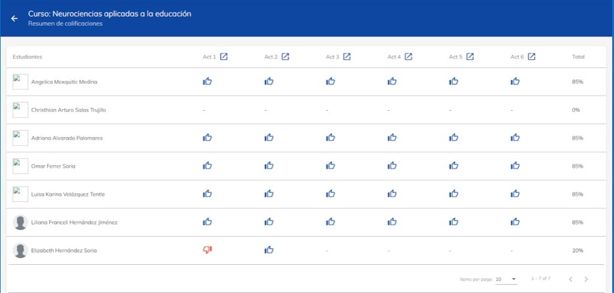
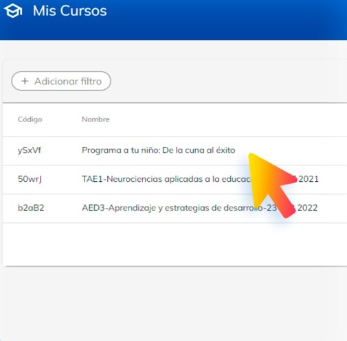
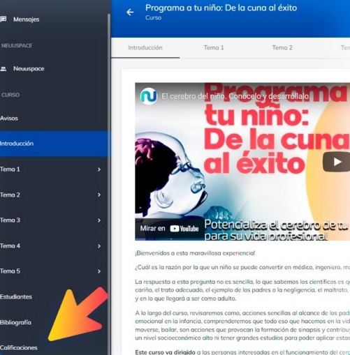
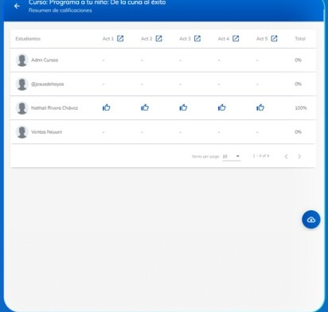
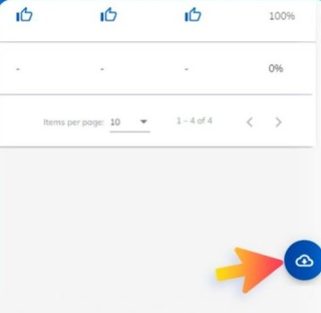

# Descargar calificaciones

En esta guía, aprenderás a descargar las calificaciones.

En este apartado aparecen todas las tareas indicadas y los resultados de los estudiantes, así como el 
acumulado alcanzado. Esta información puedes bajarla a una página de Excel, para tener el control 
de la evolución de los estudiantes. Al termino de la materia, concluidas las calificaciones, deberá 
comunicarse con Academia y enviarle los resultados de cada estudiante en el modelo correspondiente 
de Control Escolar, el cual contiene su firma electrónica.

### ¿Cómo acceder?

1. Dirígete al curso que administras.

2. En el menú de la izquierda selecciona el botón de calificaciones.

3. En esa sección podrás encontrar todas las actividades que han realizado los alumnos.

4. Para descargar la información solo es necesario darle click al botón de la nube.

