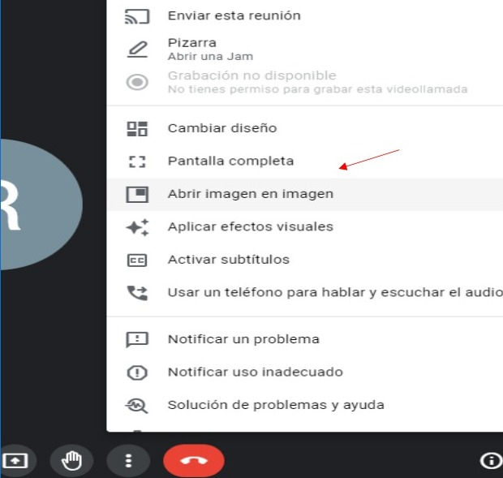
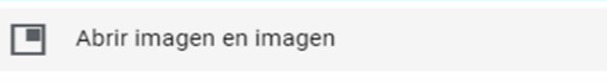
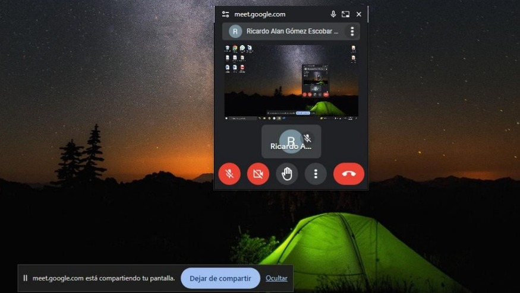
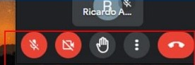
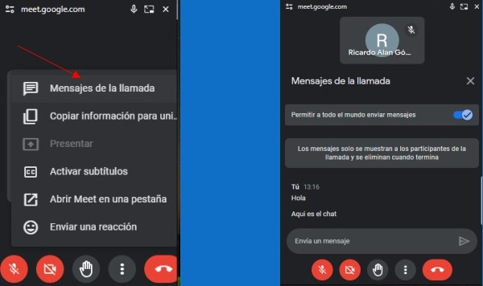

# Imagen en imagen en google meet

En esta guía, aprenderás a como acrir imagen en imagen y compartir pantalla en google meet.

Como primer paso, deveras inicializar una videoconferencia. Estando dentro de la llamada, en la parte inferior habrá distintos botones.

Seleccionamos dando clic en el botón con los tres puntos y al dar clic se abrirá un menú.

Seleccionamos dando clic en el apartado Abrir imagen en imagen.

Una vez seleccionado, se abrirá una pantalla mas pequeña, la cual podremos ocupar para visualizar
el contenido de las clases sin perder de vista a los alumnos.

Dentro de la ventana, tendremos algunas opciones las cuales podemos acceder desde la ventana.

Si damos clic en los 3 puntos, tendremos distintas opciones, donde la mas destacada es poder visualizar los mensajes que puedan llegar a mandar durante la llamada.

