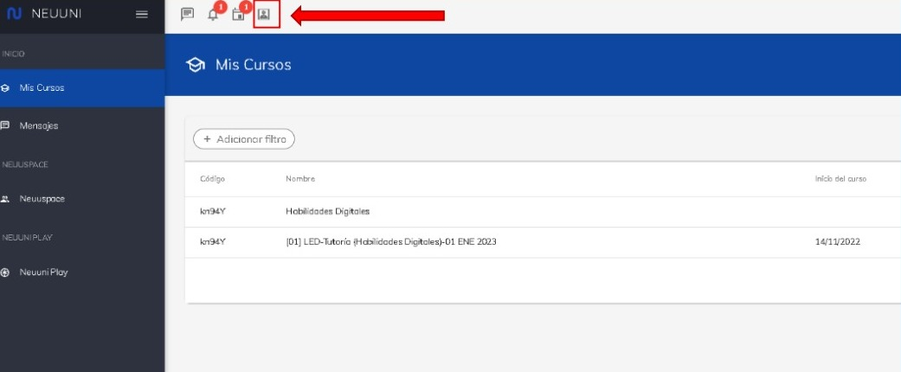
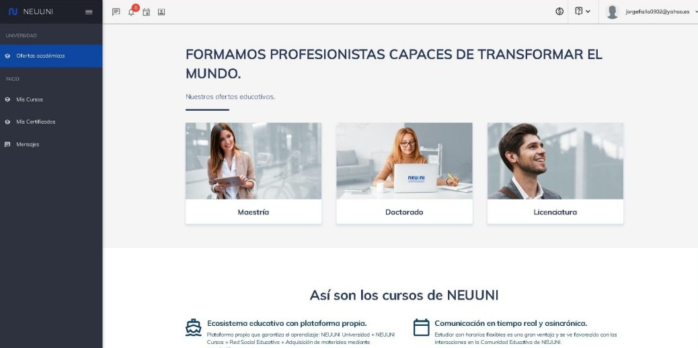

# Acceder cómo alumno

En esta guía, aprenderás a como acceder en modo alumno dentro de la plataforma de Neuuni.

Una vez dentro de la plataforma, podrá visualizar acerca de las distintas partes de las cuales se 
compone la plataforma para mentores.

En la parte superior, podrá encontrar distintos accesos directos, donde podrá acceder directamente a 
sus mensajes, notificaciones y webinars. De lado de estos apartados, se encuentra una opción la cual 
nos permitirá cambiar de vista.

Al presionar el botón, podremos ver la vista que tiene un estudiante.

Los mentores tienen la posibilidad de ser estudiantes también. Por ello, puedes acceder a una vista 
de estudiantes, dónde pueden subir tareas, y escribir en foros. Tanto para una carrera educativa cómo 
para cursos individuales
