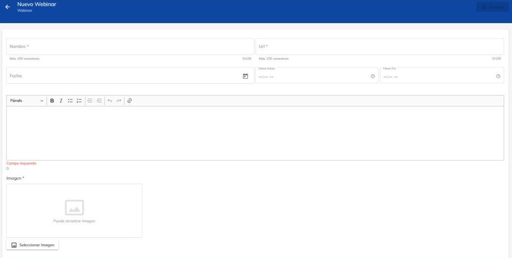
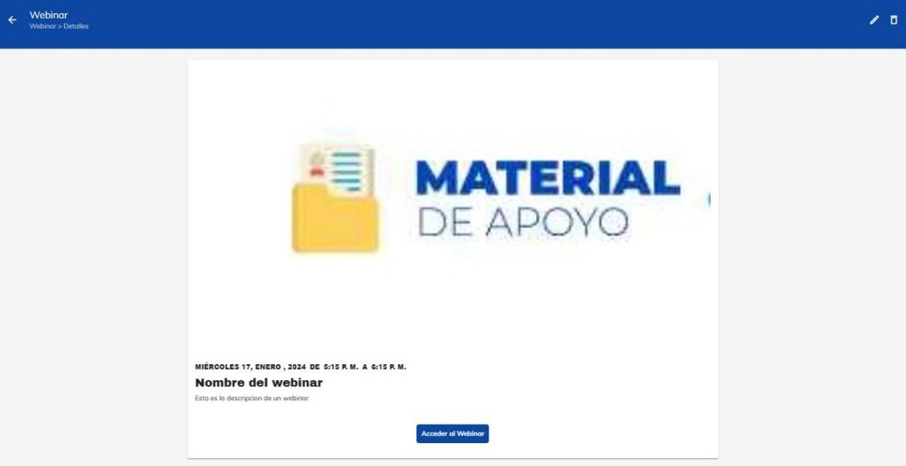
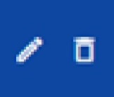

# Crear, Editar, Borrar Webinar

En esta guía, aprenderás a Crear, Editar, Borrar Webinar

Como primer paso, selecciona el curso donde desee crear un webinar. Al seleccionar el curso, podrá 
visualizar el contenido del mismo.

En la parte lateral de la derecha encontraras distinto apartados,
donde podrás encontrar el de webinar. 

Para crear un webinar, da clic en el botón con símbolo de “+”

Al presionar el botón de crear, aparecerá una ventana donde 
podremos colocar la información del webinar.

Aquí podrás colocar el nombre, fecha, hora, descripción, imagen y la liga del webinar que este por 
crearse. Al rellenar todos lo campos, en la parte superior de la derecha aparecerá un botón para 
guardar y crear el webinar.

Al crear el webinar se mostrará de la siguiente manera. También contendrá un botón donde nos 
dirigirá directamente a la conferencia.

Si desea editar o eliminar el webinar, podrá hacerlo en la parte superior de la 
derecha, podrá apreciar 2 botones que corresponden a dichas acciones.

