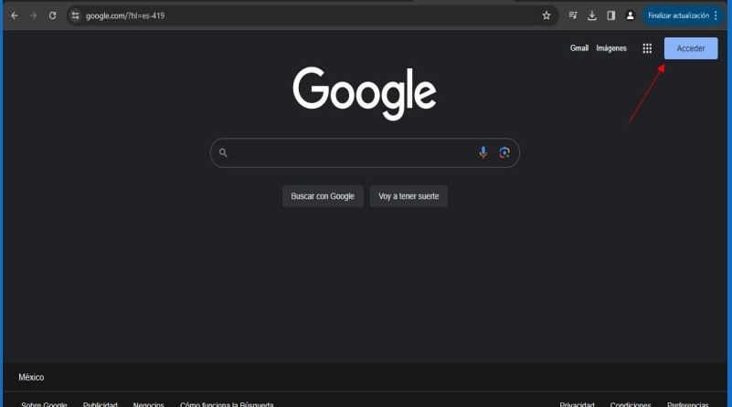
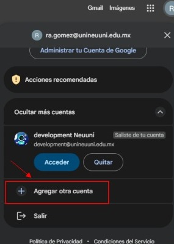
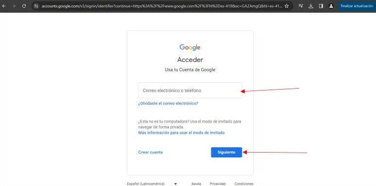
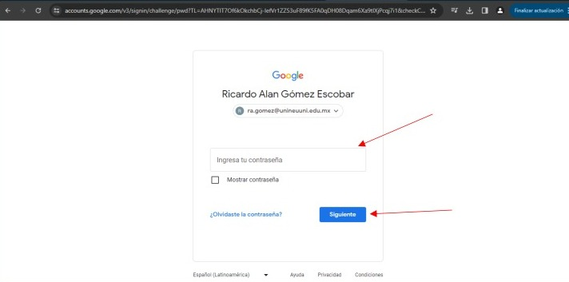
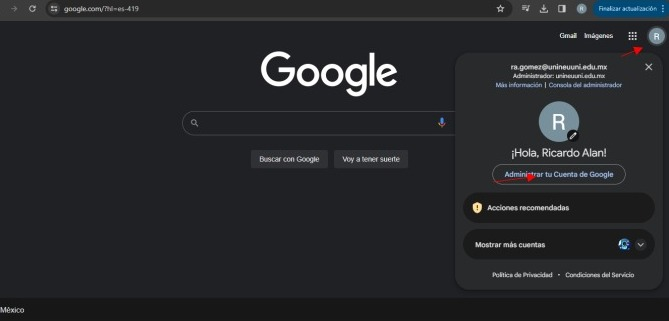

# Ingresar a gmail institucional.

### Paso 1
1. Abre tu navegador

Al ingresar, nos dirigimos en la parte superior de la derecha, donde se encontrará un botón con el nombre "Acceder"

### Paso 2
2. Si no te aparece el botón de acceder y en su lugar esta una cuenta, damos clic en la cuenta.

Cuando demos clic, aparecerá una ventana donde podremos agregas otra cuenta.

### Paso 3
3. Al dar clic en el botón de “Acceder” o “Agregar otra cuenta” nos redirigirá a otra pantalla donde nos 
pedirá ingresar nuestro correo.

Deberemos ingresar nuestra cuenta institucional en el campo y después dar clic en el botón con 
nombre de “siguiente”

### Paso 4
4. Nos pedirá que ingresemos nuestra contraseña.

### Paso 5
5. Ingresamos nuestra contraseña y damos clic en siguiente

Una vez ingresado, regresara automáticamente al navegador y podrá ver en la parte superior de la 
derecha que la cuenta fue agregada correctamente.

