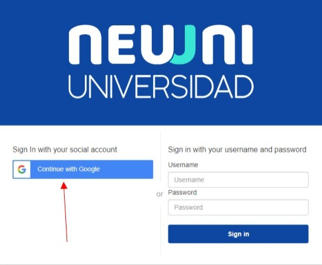
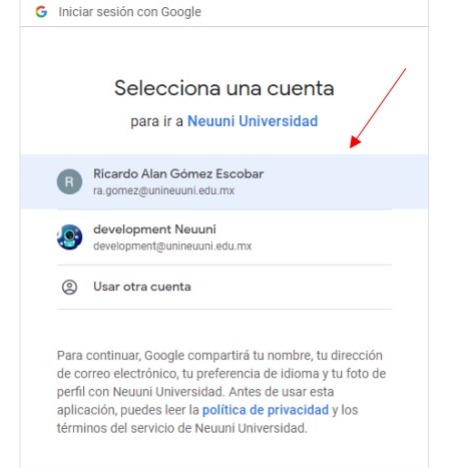

# Ingresar a la plataforma

### Paso 1
1. Ingresa a la plataforma de Neuuni en la dirección: cursos.unineuuni.edu.mx 

Al ingresar podrás visualizar la siguiente pantalla:

### Paso 2
2. Para ingresar a la plataforma, deveras dar clic en el botón azul con la leyenda: “Continuar con 
Google”.

Al dar clic en el botón, aparecerá una ventana donde nos dará a escoger con que cuenta queremos 
ingresar.

### Paso 3
3. Seleccionamos nuestra cuenta institucional. Si no aparece tu cuenta, da clic en “Usar otra cuenta” e 
ingresa tu cuenta institucional.

Una vez seleccionada tu cuenta, podrás ingresar a la plataforma de Neuuni.

###### NOTA: Si al ingresar, se queda la pantalla de carga congelada, solo refresca la página